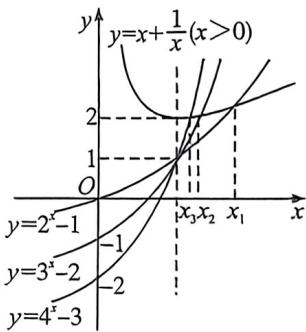

> [!faq]- 例题解析
>
> > [!success]- **【答案】** A
>
> > [!note]- **【解析】**
> > 解析 已知 $x_{1}, x_{2}, x_{3}$ 为正实数，且 $x_{1}^{2} + x_{1} + 1 = x_{1}2^{x_{1}}$ ，化简得到 $\frac{x_1^2 + 1}{x_1} = 2^{x_1} - 1$ ，进一步变形为 $x_{1} + \frac{1}{x_{1}} = 2^{x_{1}} - 1$ ；同理，由 $x_{2}^{2} + 2x_{2} + 1 = x_{2}3^{x_{2}}$ ，可得到 $\frac{x_2^2 + 1}{x_2} = 3^{x_2} - 2$ ，即 $x_{2} + \frac{1}{x_{2}} = 3^{x_{2}} - 2$ ；由 $x_{3}^{2} + 3x_{3} + 1 = x_{3}4^{x_{3}}$ ，可得到 $\frac{x_3^2 + 1}{x_3} = 4^{x_3} - 3$ ，即 $x_{3} + \frac{1}{x_{5}} = 4^{x_{5}} - 3$ ；令 $f(x) = x + \frac{1}{x}, x \in (0, +\infty)$ ，对 $f(x)$ 求导得 $f'(x) = 1 - \frac{1}{x^2}$ ，
> >
> > $$
> > f ^ {\prime} (x) <   0
> > $$
> >
> > $$
> > 1 - \frac {1}{x ^ {2}} <   0
> > $$
> >
> > $$
> > \frac {1}{x ^ {2}} > 1
> > $$
> >
> > $$
> > x > 0
> > $$
> >
> > $$
> > 0 <   x <   1
> > $$
> >
> > 当 $f^{\prime}(x) > 0$ 时， $1 - \frac{1}{x^2} > 0$ ，即 $\frac{1}{x^2} < 1$ ，因为 $x > 0$ ，所以 $x > 1$ ，此时函数 $f(x)$ 在 $(1, +\infty)$ 上单调递增；
> >
> > 当 $x = 1$ 时， $f(1) = 1 + \frac{1}{1} = 2$ ；满足 $x_{1} + \frac{1}{x_{1}} = 2^{x_{1}} - 1$ 的 $x_{1}$ 即为函数 $y = f(x)$ 与 $y = 2^{x} - 1$ 交点的横坐标；满足 $x_{2} + \frac{1}{x_{2}} = 3^{x_{2}} - 2$ 的 $x_{2}$ 即为函数 $y = f(x)$ 与 $y = 3^{x} - 2$ 交点的横坐标；满足 $x_{3} + \frac{1}{x_{3}} = 4^{x} - 3$ 的 $x_{3}$ 即为函数 $y = f(x)$ 与 $y = 4^{x} - 3$ 交点的横坐标；在同一平面直角坐标系中画出 $y = f(x), y = 2^{x} - 1, y = 3^{x} - 2, y = 4^{x} - 3$ 的图象，如图所示：
> >
> > 
> >
> > 从图象中可以直观地看出,三个交点的横坐标关系为 $x_{3}<x_{2}<x_{1}$ .
> >
> > 故选 **A**.
