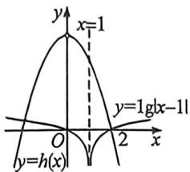

## 考点五_导数与抽象函数与原函数构造

课本中关于两个函数四则混合运算后的求导法则,在现在考试中通常两个函数解析式隐藏构造抽象函数来分析其单调性和奇偶性,我们可以探索函数不等式的属性.

构造总则： $[f(x)\pm g(x)]' = f'(x)\pm g'(x),f'(g(x)) = f'(g(x))\cdot g'(x),$

$[f'(x) \cdot g(x)]' = f'(x)g(x) + f(x)g'(x), \left[\frac{f(x)}{g(x)}\right]' = \frac{f'(x)g(x) - f(x)g'(x)}{g(x)^2}$ ，我们来一一列举常见

的构造模型：

幂函数基础构造

模型1(幂函数乘除): 当 x>0 时, $xf'(x)+nf(x)>0\Leftrightarrow[x^{n}f(x)]'\geqslant0$ ; $xf'(x)-nf(x)>0\Leftrightarrow\left[\frac{f(x)}{x^{n}}\right]'$

解得 $\hat{h}(x)=xf(x)$ 且定义域为 R，则 $h(-x)=-xf(-x)=-x\cdot[-f(x)]=xf(x)=h(x)$ ，所以 $h(x)=xf(x)$ 为偶函数，在 $x\in(0,+\infty)$ 上 $h'(x)=f(x)+xf'(x)<0$ ，所以 $h(x)$ 在 $(0,+\infty)$ 上单调递减，结合偶函数的对称性知，其在 $(-∞,0)$ 上单调递增，由 $f(2)=0$ ，则 $h(2)=0=h(-2)$ ，且 $h(0)=0$ ，则 $h(x)=\left\{\begin{aligned}xf(x),&x\neq0\\ 0,&x=0\end{aligned}\right.$ ，
由 $g(x)$ 的零点个数等价于 $h(x)$ 与 $y=\lg|x-1|$ 的交点个数，函数大致图象如下，

其中 $y = \lg |2 - 1| = 0$ ，且该函数关于 $x = 1$ 对称，在 $(- \infty, 1)$ 、 $(1, +\infty)$ 上分别单调递减、单调递增，显然 $x = -2$ 时 $y = \lg 3 > 0 = h(-2)$ ，在 $(-2, 0)$ 上 $h(x)$ 单调递增，则 $x \to 0$ 时 $h(x) > 0$ 恒成立，在 $(-2, 0]$ 上 $y = \lg |x - 1|$ 单调递减，且 $y = \lg |0 - 1| = 0$ ，所以 $\exists x_0 \in (-2, 0)$ 使 $h(x_0) = \lg |x_0 - 1|$ ，综上， $h(x)$ 与 $y = \lg |x - 1|$ 的交点横坐标有 $x_0, 0, 2$ ，即 $g(x)$ 有 3 个零点。故选：D.

![[高中/总复习/二轮/2026版高中《MST新思路思维拓展》二轮复习专题/上册/函数与导数小题篇/考点五_导数与抽象函数与原函数构造/questions/Q00093331.md]]
![[高中/总复习/二轮/2026版高中《MST新思路思维拓展》二轮复习专题/上册/函数与导数小题篇/考点五_导数与抽象函数与原函数构造/questions/Q00093152.md]]
![[高中/总复习/二轮/2026版高中《MST新思路思维拓展》二轮复习专题/上册/函数与导数小题篇/考点五_导数与抽象函数与原函数构造/questions/Q00092888.md]]
![[高中/总复习/二轮/2026版高中《MST新思路思维拓展》二轮复习专题/上册/函数与导数小题篇/考点五_导数与抽象函数与原函数构造/questions/Q00092889.md]]
![[高中/总复习/二轮/2026版高中《MST新思路思维拓展》二轮复习专题/上册/函数与导数小题篇/考点五_导数与抽象函数与原函数构造/questions/Q00093153.md]]
