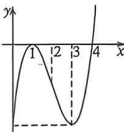

> [!faq]- 例题解析
>
> > [!success]- **【答案】** ACD
>
> > [!note]- **【解析】**
> > 解析 壁一: 对 A, 因为函数 $f(x)$ 的定义域为 R, 而 $f'(x)=2(x-1)(x-4)+(x-1)^{2}=3(x-1)(x-3)$ ,
> >
> > 易知当 $x \in (1,3)$ 时， $f'(x) < 0$ ，当 $x \in (-\infty,1)$ 或 $x \in (3, +\infty)$ 时， $f'(x) > 0$ ，函数 $f(x)$ 在 $(- \infty,1)$ 上单调递增，在 $(1,3)$ 上单调递减，在 $(3, +\infty)$ 上单调递增，故 $x = 3$ 是函数 $f(x)$ 的极小值点，正确；
> >
> > 对 B, 当 0 < x < 1 时, $x - x^{2} = x(1 - x) > 0$ , 所以 $1 > x > x^{2} > 0$ , 而由上可知, 函数 $f(x)$ 在 $(0,1)$ 上单调递增, 所以 $f(x) > f(x^{2})$ , 错误;
> >
> > 对 C, 当 1 < x < 2 时, 1 < 2x - 1 < 3, 而由上可知, 函数 $f(x)$ 在 (1, 3) 上单调递减, 所以 $f(1) > f(2x - 1) > f(3)$ , 即 -4 < f(2x - 1) < 0, 正确;
> >
> > 对 D, 当 -1 < x < 0 时, $f(2 - x) - f(x) = (1 - x)^{2}(-2 - x) - (x - 1)^{2}(x - 4) = (x - 1)^{2}(2 - 2x) > 0$ ,
> > 所以 $f(2-x)>f(x)$ ，正确；
> >
> > 
> >
> > 法二:利用零点穿根和三次函数四段论,简化处理,由于两个零点 $x_{1}=1$ (偶回), $x_{2}=4$ (奇穿),故我们能作出其图像,结合四段论的理论,对称中心为(2,-2), $x=1$ 为极大值点, $x=3$ 为极小值点,A 正确;函数 $f(x)$ 在(0,1)上单调递增,所以 $f(x)>f(x^{2})$ ,B 错误;当 $1<x<2$ 时, $1<2x-1<3,-4<f(2x-1)<0$ ,C 正确;当 $-1<x<0$ 时, $2-x\in(2,3)$ , $f(2-x)>f(3)=f(0)>f(x)$ ,D 正确;
> >
> > 故选 **ACD**.
