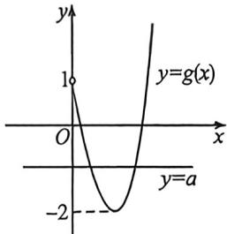

> [!faq]- 例题解析
>
> > [!success]- **【答案】** D
>
> > [!note]- **【解析】**
> > 解析 令 $x^{2} - 3x = -(x - 1)^{2} + a$ ，即 $a = x^{3} + x^{2} - 5x + 1$ ，令 $g(x) = x^{3} + x^{2} - 5x + 1 (x > 0)$ ，
> >
> > 则 $g^{\prime}(x) = 3x^{2} + 2x - 5 = (3x + 5)(x - 1)$ ，令 $g^{\prime}(x) = 0(x > 0)$ 得 $x = 1$
> >
> > 当 $x \in (0,1)$ 时， $g'(x) < 0, g(x)$ 单调递减，当 $x \in (1, +\infty)$ 时， $g'(x) > 0, g(x)$ 单调递增， $g(0) = 1, g(1) = -2$ ，因为曲线 $y = x^3 - 3x$ 与 $y = -(x - 1)^2 + a$ 在 $(0, +\infty)$ 上有两个不同的交点，
> >
> > 
> >
> > 所以等价于 $y = a$ 与 $g(x)$ 有两个交点，所以 $a \in (-2,1)$ . 故答案为： $(-2,1)$
> >
> > 例 (2026 届杭州一模 T8) 设函数 $f(x) = x^3 + 3x^2 + 6x + 5$ ，若 $f(a) = 15, f(b) = -13$ ，则 $a + b = ()$ A. 2 B. 1 C. -1 D. -2
> >
> > 解析 表一: 因为 $f(x)=x^{3}+3x^{2}+6x+5$ ，所以 $f(x)=(x+1)^{3}+3(x+1)+1$ ，
> >
> > 因为 $f(a)=15, f(b)=-13$ ，所以 $f(a)+f(b)=2$ ，
> >
> > 所以 $(a + 1)^{3} + 3(a + 1) + (b + 1)^{3} + 3(b + 1) = 0$ ①，令 $F(x) = x^{3} + 3x$
> >
> > 则 $F(-x) = -F(x)$ , 所以 $F(x)$ 为奇函数, 所以①式可变为 $F(a + 1) = -F(b + 1)$ , 即 $F(a + 1) = F(-b - 1)$ , 因为 $F(x) = x^2 + 3x$ 为单调递增函数, 所以 $a + 1 = -b - 1$ , 所以 $a + b = -2$ . 故选: D.
> >
> > 法二:由结论:a,b关于对称中心对称,对称中心纵坐标为 $\frac{f(a)+f(b)}{2}=1=f(x_{0})$ ,令 $x^{3}+3x^{2}+6x+5=1$ ,即 $(x+1)(x^{2}+2x+4)=0$ ,解得x=-1,所以 $a+b=-2$ .
