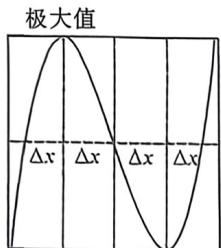
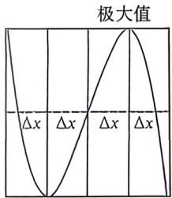

## 考点六_三次函数问题

作为连续三年出现在高考真题里,三次函数已经成为小题重点中的重点,了解其对称型,韦达定理和常见结论,把三次函数小题化很重要.

## 一、三次函数对称性与四段论

①三次函数是中心对称曲线,且对称中心是 $\left(-\frac{b}{3a},f\left(-\frac{b}{3a}\right)\right)$ ;

②其导函数为 $f'(x)=3ax^{2}+2bx+c=0$ 对称轴为 $x=-\frac{b}{3a}$ ，所以对称中心的横坐标也就是导函数的对称轴，可见， $y=f(x)$ 图象的对称中心在导函数 $y=f'(x)$ 的对称轴上，且又是两个极值点的中点，同时也是二阶导为零的点；

③三次函数四段论

$f(x) = ax^{3} + bx^{2} + cx + d(a > 0)$ 且导函数 $\Delta >0$ $f(x) = ax^3 +bx^2 +cx + d(a <   0)$ 且导函数 $\Delta >0$

极小值等值点 中心 极小值

极小值 中心 极小值等值点

①对称中心： $\left(-\frac{b}{3a},f\left(-\frac{b}{3a}\right)\right)$ ;

②极大值到对称中心距离为 $\Delta x$ , 极小值点到对称中心距离为 $\Delta x$ , 极小值等值点到极大值点距离为 $\Delta x$ , 极大值等值点到极小值点距离为 $\Delta x$ ; 设 $f(x)$ 的极大值为 $M$ , 当 $f(x) = M$ 的两根为 $x_{1}, x_{2} (x_{1} < x_{2})$ 时, 区间 $[x_{1}, x_{2}]$ 被中心 $\left(-\frac{b}{3a}, f\left(-\frac{b}{3a}\right)\right)$ 和极小值点三等分, 类似的, 对极小值 $N$ 也有此结论.

![[高中/总复习/二轮/2026版高中《MST新思路思维拓展》二轮复习专题/上册/函数与导数小题篇/考点六_三次函数问题/questions/Q00092891.md]]
![[高中/总复习/二轮/2026版高中《MST新思路思维拓展》二轮复习专题/上册/函数与导数小题篇/考点六_三次函数问题/questions/Q00092892.md]]
![[高中/总复习/二轮/2026版高中《MST新思路思维拓展》二轮复习专题/上册/函数与导数小题篇/考点六_三次函数问题/questions/Q00092893.md]]

## 二、三次函数韦达定理与零点处切线斜率和问题

$$
f (x) = a x ^ {3} + b x ^ {2} + c x + d = a \left(x - x _ {1}\right) \left(x - x _ {2}\right) \left(x - x _ {3}\right),
$$

展开得: $x_{1}+x_{2}+x_{3}=-\frac{b}{a},x_{1}x_{2}+x_{2}x_{3}+x_{1}x_{3}=\frac{c}{a},x_{1}x_{2}x_{3}=-\frac{d}{a}.$

在三个零点处的切线斜率倒数和为： $\frac{1}{f'(x_1)} +\frac{1}{f'(x_2)} +\frac{1}{f'(x_3)} = \frac{1}{a(x_1 - x_2)(x_1 - x_3)} +$ $\frac{1}{a(x_2 - x_1)(x_2 - x_3)} +\frac{1}{a(x_3 - x_1)(x_3 - x_2)} = \frac{(x_2 - x_3) + (x_3 - x_1) + (x_1 - x_2)}{a(x_1 - x_2)(x_1 - x_3)(x_2 - x_3)} = 0$

![[高中/总复习/二轮/2026版高中《MST新思路思维拓展》二轮复习专题/上册/函数与导数小题篇/考点六_三次函数问题/questions/Q00092894.md]]
![[高中/总复习/二轮/2026版高中《MST新思路思维拓展》二轮复习专题/上册/函数与导数小题篇/考点六_三次函数问题/questions/Q00092895.md]]
![[高中/总复习/二轮/2026版高中《MST新思路思维拓展》二轮复习专题/上册/函数与导数小题篇/考点六_三次函数问题/questions/Q00092896.md]]

## 二、三次函数韦达定理与零点处切线斜率和问题

$f(x) = ax^{3} + bx^{2} + cx + d = a(x - x_{1})(x - x_{2})(x - x_{3})$

展开得: $x_{1}+x_{2}+x_{3}=-\frac{b}{a},x_{1}x_{2}+x_{2}x_{3}+x_{1}x_{3}=\frac{c}{a},x_{1}x_{2}x_{3}=-\frac{d}{a}.$

在三个零点处的切线斜率倒数和为： $\frac{1}{f'(x_1)} +\frac{1}{f'(x_2)} +\frac{1}{f'(x_3)} = \frac{1}{a(x_1 - x_2)(x_1 - x_3)} +$ $\frac{1}{a(x_2 - x_1)(x_2 - x_3)} +\frac{1}{a(x_3 - x_1)(x_3 - x_2)} = \frac{(x_2 - x_3) + (x_3 - x_1) + (x_1 - x_2)}{a(x_1 - x_2)(x_1 - x_3)(x_2 - x_3)} = 0$

![[高中/总复习/二轮/2026版高中《MST新思路思维拓展》二轮复习专题/上册/函数与导数小题篇/考点六_三次函数问题/questions/Q00093353.md]]
![[高中/总复习/二轮/2026版高中《MST新思路思维拓展》二轮复习专题/上册/函数与导数小题篇/考点六_三次函数问题/questions/Q00093227.md]]
![[高中/总复习/二轮/2026版高中《MST新思路思维拓展》二轮复习专题/上册/函数与导数小题篇/考点六_三次函数问题/questions/Q00093154.md]]

## 例7 (2026 届湖甯永州一模 T11·多选)下列关于函数 $f(x) = -x^{3} + ax + 1$ 的说法,正确的有

A. 若 $f\left(\frac{1}{2}\right) = 2$ ，则 $f\left(-\frac{1}{2}\right) = 0$

B. 当 $0 < a < \frac{3}{2}$ 时, $f(x)$ 的图象不经过第三象限

C. 若 $f(x)$ 有三个零点 $x_{1}, x_{2}, x_{3}$ ，则 $x_{1}x_{2} + x_{2}x_{3} + x_{3}x_{1} = a$

D. 若有且只有一个正方形的四个顶点在函数 $f(x)$ 图象上, 则 $a = 2\sqrt{2}$

解析 由已知 $f(x) = -x^3 + ax + 1$ ，则 $f(-x) = x^3 - ax + 1$ ，即 $f(x) + f(-x) = 2$ ，即函数 $f(x) = -x^3 + ax + 1$ 图象关于点(0,1)中心对称，

A选项： $f\left(\frac{1}{2}\right) + f\left(-\frac{1}{2}\right) = 2$ ，即 $2 + f\left(-\frac{1}{2}\right) = 2$ ，则 $f\left(-\frac{1}{2}\right) = 0,$ A选项正确；

B选项:由已知 $f(x)=-x^{3}+ax+1$ ，则 $f'(x)=-3x^{2}+a$ ，又 $0<a<\frac{3}{2}$ ， $f'(x)=-3x^{2}+a=0$ ，解得 $x_{1}=-\sqrt{\frac{a}{3}}$ ， $x_{2}=\sqrt{\frac{a}{3}}$ ，易知函数 $f(x)$ 在 $(-∞,-\sqrt{\frac{a}{3}})$ 和 $(\sqrt{\frac{a}{3}},+\infty)$ 上单调递减，在 $(-√\frac{a}{3},√\frac{a}{3})$ 上单调递增，所以函数 $f(x)$ 在 $x=-\sqrt{\frac{a}{3}}$ 时取得极小值为 $f(-\sqrt{\frac{a}{3}})=\frac{a}{3}\sqrt{\frac{a}{3}}-a\sqrt{\frac{a}{3}}+1=-2(\sqrt{\frac{a}{3}})^{3}+1$ ，又 $0<a<\frac{3}{2}$ ，则 $\sqrt{\frac{a}{3}}\in(0,\frac{\sqrt{2}}{2})$ ，所以 $f(-\sqrt{\frac{a}{3}})=-2(\sqrt{\frac{a}{3}})^{3}+1\in(1-\frac{\sqrt{2}}{2},1)$ ，即 $f(-\sqrt{\frac{a}{3}})>0$ ，函数不经过第三象限，B选项正确；
C选项:若 $f(x)$ 有三个零点 $x_{1},x_{2},x_{3}$ ，由韦达定理： $\left\{\begin{aligned}&x_{1}+x_{2}+x_{3}=0\\ &-(x_{1}x_{2}+x_{2}x_{3}+x_{1}x_{3})=a,\\ &x_{1}x_{2}x_{3}=1\end{aligned}\right.$ ，即 $x_{1}x_{2}+x_{2}x_{3}+x_{3}x_{1}=-a,C$ 选

项错误；

D选项:由函数的对称性及正方形的对称性可知,若有且只有一个正方形的四个顶点在函数 $f(x)$ 图象上,则正方形的对称中心为(0,1),设该正方形ABCD的顶点依次为 $A(x_{1},y_{1}),B(x_{2},y_{2}),C(x_{3},y_{3}),D(x_{4},y_{4})$ ,

则 $x_{3} = -x_{1}, x_{4} = -x_{2}$ , 由正方形性质可知 $AB \perp BC, AC \perp BD$ , 又 $k_{AB} = \frac{y_{2} - y_{1}}{x_{2} - x_{1}} = \frac{-x_{2}^{3} + ax_{2} + 1 - (-x_{1}^{3} + ax_{1} + 1)}{x_{2} - x_{1}}$

$$
= - \left(x _ {2} ^ {2} + x _ {1} x _ {2} + x _ {1} ^ {2} - a\right), k _ {D C} = \frac {y _ {3} - y _ {3}}{x _ {2} - x _ {3}} = - \left(x _ {3} ^ {2} + x _ {3} x _ {2} + x _ {3} ^ {2} - a\right) = - \left(x _ {2} ^ {2} - x _ {1} x _ {2} + x _ {1} ^ {2} - a\right),
$$

$$
k _ {A C} = \frac {y _ {3} - y _ {1}}{x _ {3} - x _ {1}} = \frac {- x _ {3} ^ {3} + a x _ {3} + 1 - (- x _ {1} ^ {3} + a x _ {1} + 1)}{x _ {3} - x _ {1}} = \frac {2 x _ {1} ^ {3} - 2 a x _ {1}}{- 2 x _ {1}} = - x _ {1} ^ {2} + a, k _ {B D} = \frac {y _ {4} - y _ {2}}{x _ {4} - x _ {2}} = - x _ {2} ^ {2} + a,
$$

则 $k_{AB} \cdot k_{BC} = -1$ ，即 $(x_1^2 + x_2^2 - a)^2 - (x_1 x_2)^2 = -1$ ①，

$k_{AC} \cdot k_{BD} = -1$ ，即 $(-x_{1}^{2} + a)(-x_{2}^{2} + a) = -1$ ，即 $(x_{1}x_{2})^{2} = -1 - a^{2} + a(x_{1}^{2} + x_{2}^{2})$ ，

代入①中可得 $(x_{1}^{2} + x_{2}^{2} - a)^{2} - a(x_{1}^{2} + x_{2}^{2}) + 2 + a^{2} = 0$ ，又 $x_{1}\neq x_{2}$ ，可设 $t = x_1^2 +x_2^2 >0$

则 $(t - a)^2 - at + 2 + a^2 = 0$ ，即 $t^2 - 3at + 2a^2 + 2 = 0$ ，又有且只有一个正方形满足题意，即方程 $t^2 - 3at + 2a^2 + 2 = 0$ 有且只有一个正解，即 $\left\{ \begin{array}{l} (-3a)^2 - 4(2a^2 + 2) = 0 \\ 3a > 0 \end{array} \right.$ ，解得 $a = 2\sqrt{2}$ ，D选项正确；故选：ABD.

![[高中/总复习/二轮/2026版高中《MST新思路思维拓展》二轮复习专题/上册/函数与导数小题篇/考点六_三次函数问题/questions/Q00092901.md]]
![[高中/总复习/二轮/2026版高中《MST新思路思维拓展》二轮复习专题/上册/函数与导数小题篇/考点六_三次函数问题/questions/Q00092902.md]]
