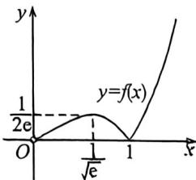

<!-- question-source:start -->
例52 (2026 届山西九月调研 T8) 已知关于 $x$ 的方程 $\frac{a}{x} = |x \ln x|$ 有一个实根, 则实数 $a$ 的取值范围为

A. $\left\{a \mid a=0 \text{ 或 } a>\frac{1}{2e}\right\}$ B. $\left\{a \mid 0 \leqslant a < \frac{1}{e}\right\}$ C. $\left\{a \mid \frac{1}{2e}<a \leqslant \frac{1}{e}\right\}$ D. $\left\{a \mid \frac{1}{2e} \leqslant a \leqslant \frac{1}{e}\right\}$

<!-- question-source:end -->

![[高中/总复习/二轮/2026版高中《MST新思路思维拓展》二轮复习专题/上册/函数与导数小题篇/考点四_导数的切线恒成立零点问题/questions/answers/Q00092877A1.md]]
