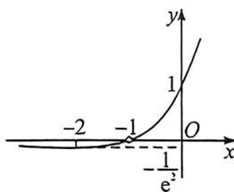

> [!faq]- 例题解析
>
> > [!success]- **【答案】** D
>
> > [!note]- **【解析】**
> > 解析 因为关于 $x$ 的方程 $\frac{a}{x + 1} = e^x$ 的解集有2个子集, 所以方程 $\frac{a}{x + 1} = e^x (x \neq -1)$ 恰有一个实数解, 即 $(x + 1)e^{x} = a (x \neq -1)$ 恰有一个实数解, 令 $f(x) = (x + 1)e^{x} (x \neq -1)$ , 则直线 $y = a$ 与函数 $y = f(x)$ 的图象有一个交点, 又因为 $f'(x) = (x + 2)e^{x}$ , 所以当 $x \in (-\infty, -2)$ 时, $f'(x) < 0$ 恒成立, $f(x)$ 单调递减;
> >
> > 当 $x \in (-2, -1)$ 时， $f'(x) > 0$ 恒成立， $f(x)$ 单调递增；当 $x \in (-1, +\infty)$ 时， $f'(x) > 0$ 恒成立， $f(x)$ 单调递增；所以当 $x = -2$ 时，函数 $y = f(x)$ 取得最小值，最小值为 $f(-2) = -\frac{1}{e^2}$ ，且当 $x < -1$ 时， $f(x) < 0$ ，当 $x > -1$ 时， $f(x) > 0$ ，作出函数 $y = f(x)$ 的图象，如图所示：
> >
> > 
> >
> > 由此可得当 $a = -\frac{1}{e^2}$ 或 $a > 0$ 时，直线 $y = a$ 与函数 $y = f(x)$ 的图象有一个交点，所以 $a$ 的取值范围是 $\left\{-\frac{1}{e^2}\right\} \cup (0, +\infty)$ ，故选：D.
> >
> > 这类题如果能采用同构函数平移作图的优先平移作图, 考场上能节约时间, 同构函数的图像及其应用参考导数专题书.
