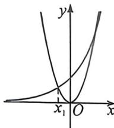
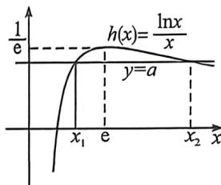

> [!faq]- 例题解析
>
> > [!success]- **【答案】** ABC
>
> > [!note]- **【解析】**
> > 令 $f(x)=e^{x}-ax^{2}=0$ 可得， $a=\frac{e^{x}}{x^{2}}$ ，设 $g(x)=\frac{e^{x}}{x^{2}}(x>0)$ ，则 $g'(x)=\frac{e^{x}(x-2)}{x^{3}}$ ，所以 $g(x)$ 的最小值为 $g(2)=\frac{e^{2}}{4}$ ，要使得 $f(x)=e^{x}-ax^{2}$ 有两个大于0的零点，则 $a>\frac{e^{2}}{4}$ ，B选项正确；
> >
> > 
> >
> > 易知 $\frac{e^{\lambda}}{x_1^2} = \frac{e^{x_1}}{x_2^2} = \frac{e^{x_2}}{x_3^2}$ ，所以 $\frac{e^{\lambda} e^{x_1}}{x_1^2 x_3^2} = \frac{e^{x_1 + x_2}}{x_1^2 x_3^2} = \frac{e^{2x_1}}{x_2^4}$ ，由于 $x_1, x_2, x_3$ 成等差数列，所以 $x_1 + x_3 = 2x_2$ ，所以 $x_1^2 x_3^2 = x_2^4$
> >
> > 所以 $-x_{1}x_{2}=x_{2}^{1},-x_{1},x_{2},x_{2}$ 成等比数列，C选项正确； $-x_{1}x_{3}=x_{2}^{2}=\left(\frac{x_{1}+x_{3}}{2}\right)^{2}$ ，即得 $-6x_{1}x_{3}=x_{1}^{2}+x_{3}^{2}$ ，所以 $\left(\frac{x_{3}}{x_{1}}\right)^{2}+\frac{6x_{5}}{x_{1}}+1=0$ ，由于 $\frac{x_{1}}{x_{1}}<0$ ，解得 $\frac{x_{3}}{x_{1}}=-3-2\sqrt{2}$ ，因为 $\frac{x_{3}^{2}}{x_{1}^{2}}=e^{x_{1}-x_{1}}$ ，所以 $x_{3}-x_{1}=2\ln\left(-\frac{x_{3}}{x_{1}}\right)=4\ln(1+\sqrt{2})$ ，D选项错误。故选：ABC.
> >
> > 例四（2026 届山东名校联盟开学考 T11·多选）已知函数 $f(x)=ae^{ax}-\ln x(a>0)$ 有两个零点，设其由小到大分别为 $x_{1}, x_{2}$ ，则
> >
> >
> > A. 实数 $a$ 的取值范围是 $\left(0, \frac{1}{e}\right)$ B. $(x_1 - e)(x_2 - e) < 0$ C. $f'(x_1) > a - \frac{1}{e}$ D. $x_1 + x_2 > 2e$
> >
> > 解析 (1) 定义域为 $(0, +\infty)$ , $f(x)$ 有两个零点, 可化为 $ax e^{ax} = x \ln x$ 有两个解, 又由于 $a > 0$ , 所以左侧恒大于 0 , 故右侧也恒大于 0 , 可得 $x > 1$ , 设 $g(x) = x e^x$ , 则 $g'(x) = (x + 1)e^x$ , $g(x)$ 在 $(-1, +\infty)$ 单调递增, 原方程可化为 $g(ax) = g(\ln x)$ , 由于 $ax > 0, \ln x > 0$ , 都在 $g(x)$ 的单调增区间里, 所以 $ax = \ln x$ , 即 $a = \frac{\ln x}{x}$ ,
> >
> > 由同构函数如图:则要使 $a=\frac{\ln x}{x}$ 有两个解, 即 y=a 与 $h(x)$ 图像有两个交点,
> >
> > 由图像可得 $a$ 的范围是 $\left(0, \frac{1}{e}\right)$ ，故 A 选项正确；同样由图象可得 $1 < x_1 < e < x_2$ ，所以 $(x_1 - e)(x_2 - e) < 0$ ，故 B 选项正确； $f'(x) = a^2 e^{ax} - \frac{1}{x}, f'(x_1) = a^2 e^{ax_1} - \frac{1}{x_1}$ ，结合 $f(x_1) = ae^{ax_1} - \ln x_1 = 0$ ，可得 $f'(x_1) = a\ln x_1 - \frac{1}{x_1}$ ，设 $F(x) = a\ln x - \frac{1}{x}$ ，由于 $a > 0$ ，则 $F(x)$ 单调递增，所以 $F(x_1) < F(e) = a - \frac{1}{e}$ ，故 C 错误；
> >
> > 
> >
> > 由图象:极值点左偏 $x_{1}+x_{2}>2e$ , 故 D 正确; 故选: ABD.
> >
> > 本题考察的比较综合,既考察到同构,又考察到零点问题,以及极值点偏移问题,作为小题,我们完全可以从图像得到两个解的关系,没必要再结合对称构造之类的证明.
