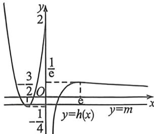

> [!faq]- 例题解析
>
> > [!success]- **【答案】** B
>
> > [!note]- **【解析】**
> > 由 $g(0)-m+0=0$ ，对于任意m恒成立，所以x=0是其中的一个零点；
> >
> > 当 $x \neq 0$ 时, $g(x) = f(x) - mx$ 有三个非零掌点, 即 $f(x) - mx = 0$ , $\frac{f(x)}{x} = m$ , 所以 $y = \frac{f(x)}{x}$ 的图象与直线 $y = m$ 有三个交点, 则 $\frac{f(x)}{x} = \left\{ \begin{array}{l} x^2 + 3x + 2, \\ \frac{\ln x}{x}, x > 0 \end{array} \right.$ , 当 $x > 0$ , $h(x) = \frac{\ln x}{x}$ , $h'(x) = \frac{1 - \ln x}{x^1}$ , 当 $0 < x < e$ , $h'(x) > 0$ , $h(x)$ 单调递增; 当 $x > e$ , $h'(x) < 0$ , $h(x)$ 单调递减, 所以 $h(x)_{\max} = h(e) = \frac{1}{e}$ . 当 $x < 0$ , $h(x) = x^2 + 3x + 2$ , 为二次函数, 开口向上, 对称轴为 $x = -\frac{3}{2}$ , 则 $h(x)$ 在 $(-∞, -\frac{3}{2})$ 单调递减, 在 $(-−\frac{3}{2}, 0)$ 单调递增, 所以 $h(x)_{\min} = h\left(-\frac{3}{2}\right) = -\frac{1}{4}$ . 作
> >
> > $$
> > y = h (x)
> > $$
> >
> > 又因为 $y = h(x)$ 的图象与 $y = m$ 有三个交点，所以 $m$ 的取值范围为 $-\frac{1}{4} < m \leqslant 0$ 或者 $m = \frac{1}{e}$ . 综上，实数 $m$ 的取值范围为 $\left(-\frac{1}{4}, 0\right] \cup \left\{\frac{1}{e}\right\}$ . 故选：B.
> >
> > 
