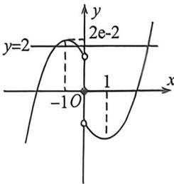

> [!faq]- 例题解析
>
> > [!success]- **【答案】** ABD
>
> > [!note]- **【解析】**
> > 当 $x < 0$ 时， $-x > 0$ ，函数是奇函数，所以 $f(x) = -f(-x) = -[((-x)^2 - 3)e^{-x} + 2] = -(x^2 - 3)e^{-x} - 2$ ，所以 B 正确。 $f'(x) = (x^2 + 2x - 3)e^x = (x - 1)(x + 3)e^x, x \in (0,1), f'(x) < 0$ ，函数是减函数， $x \in (1, +\infty), f'(x) > 0$ 。函数是增函数，所以 $x = 1$ 是极小值点， $f(1) = 2 - 2c$ ，因力函数是奇函数，所以 $x = -1$ 是极大值点，D 正确；极大值为 $2e - 2 > 2$ ，又因为 $f(\sqrt{3}) = 2$ ，函数图象如下：
> >
> > 
> >
> > 由图像可得 C 不正确. 故选: ABD.
> >
> > 导数的本质就是对函数图像的翻译, 数形结合, 不论大题还是小题, 都离不开函数图像.
