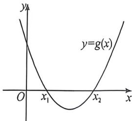

> [!faq]- 例题解析
>
> > [!success]- **【答案】** C
>
> > [!note]- **【解析】**
> > 解析 $2f(x)=a\ln x+(x-a)^{2}$ ，得 $f'(x)=\frac{a}{x}+2x-2a=\frac{2x^{2}-2ax+a}{x}(x>0)$ 。由题意，得 $2x^{2}-2ax+a=0$ 在 $(0,+\infty)$ 有两个不相等的实数根 $x_{1}, x_{2} (x_{1}<x_{2})$ 。令 $g(x)=2x^{2}-2ax+a$ ，则函数 $g(x)$ 的图象如图所示
> >
> > 所以 $\left\{ \begin{array}{l} x_{1} + x_{2} = -\frac{-2a}{2} > 0 \\ x_{1} \cdot x_{2} = \frac{a}{2} > 0 \\ \Delta = (2a)^{2} - 8a > 0 \end{array} \right.$ ，解得 $a > 2$
> >
> > 
> >
> > 此时， $x\in (0,x_1)$ 时， $g(x) > 0$ ，所以 $f^{\prime}(x) > 0,f(x)$ 单调递增； $x\in (x_{1},x_{2})$ 时， $g(x) <   0,$
> >
> > 所以 $f^{x}(x)<0,f(x)$ 单调递减；即当 $x=x_{1}$ 时， $f(x)$ 取得极大值.所以实数a的取值范围是 $(2,+\infty)$ 。故选：C.
> >
> > 例(2026 届河甫项凡计划(一)T11·赛选)已知函数 $f(x)$ 是定义在 R 上的可导函数, $f(1)=2e$ , 且 $f(x)+e^{2+y}f(-y)=e^{2}f(x-y)$ , 则
> >
> > A. 曲线 $y = \frac{f(x + 1)}{e^{r + 1}}$ 关于点(-1,0)中心对称
> >
> > B. $f(x)$ 在 $\mathbf{R}$ 上单调递增
> >
> > C. $e f(x) + 2 \geqslant 0$
> >
> > D. 函数 $F(x) = f(2x + 1) - f(2ex + e)$ 的所有零点之和为 $\frac{2e - 1}{2 - 2e}$
> >
> > $\frac{f(x)}{e}+\frac{f(-y)}{e^{-y}}=\frac{f(x-y)}{e^{-y}}$ ，设 $g(x)=\frac{f(x)}{e^{2}}$ ，则 $g(x)+g(y)=g(x+y)$ ， $g(1)=\frac{f(1)}{e}=2$ ，
> >
> > A 选项, 令 x=y=0, 可得 $g(0)=0$ , $f(0)=0$ ,
> >
> > 令 $y = -x$ ，则 $g(x) + g(-x) = g(0) = 0$ ，即 $g(x)$ 为奇函数，关于原点对称，
> >
> > $y=\frac{f(x+1)}{e^{x+1}}$ 图像可由 $g(x)$ 图像向左平移 1 个单位得到，所以 $y=\frac{f(x+1)}{e^{x+1}}$ 图像关于 $(-1,0)$ 中心对称，故 A 正确；B
> > 选项， $g(-1)=-g(1)=-2, g(-2)=g(-1)+g(-1)=-4, f(-1)=-\frac{2}{e}, f(-2)=-\frac{4}{e^{2}},$ 则 $f(-2)>f(-1)$ ，故 B 错误。
> >
> > $$
> > f (- 2) > f (- 1)
> > $$
> >
> > C选项,对于 $g(x)+g(y)=g(x+y)$ ,两边同时对x求导,得 $g'(x)=g'(x+y)$ ,
> >
> > 由 $y \in \mathbb{R}$ 知 $g'(x)$ 为常函数，则 $g(x)$ 为一次函数，由 $g(0) = 0, g(1) = 2$ 可得 $g(x) = 2x$
> >
> > 则 $f(x) = 2xe^{x}, f'(x) = 2(x + 1)e^{x}, x \in (-\infty, -1)$ 时， $f'(x) < 0, f(x)$ 单调递减，
> >
> > $x \in (-1, +\infty)$ 时， $f'(x) > 0, f(x)$ 单调递增，则 $f(x) \geqslant f(-1) = -\frac{2}{e}$ ，即 $ef(x) + 2 \geqslant 0$ ，故 C 正确；
> >
> > D选项, $F(x)=f(2x+1)-f(2ex+e)=0$ ,即 $2(2x+1)e^{2x+1}=2(2ex+e)e^{2cx+e}$ ,
> >
> > 解得 $x = -\frac{1}{2}$ 或 $x = \frac{e}{2 - 2e}$ ，所以所有零点之和为 $\frac{2e - 1}{2 - 2e}$ ，故D正确；故选：ACD.
> >
> > 例(2026届·河南华师联盟十月质检 T14)已知函数 $f(x)=e^{|x-2|}+a(3^{x-2}+3^{2-x})-a^{2}-2a$ 有唯一的零点,则实数 a= \_\_\_\_.
> >
> > 解析 令 $t-2=t$ , 有 $f(x)=g(t)=e^{|t|}+a(3^{t}+3^{-t})-a^{2}-2a$ , 由函数 $g(-t)=e^{|t|}+a(3^{-t}+3^{t})-a^{2}-2a=g(t)$ , 所以 $g(t)$ 是偶函数, 若函数 $f(x)$ 有唯一的零点, 可得函数 $g(t)$ 也唯一的零点, 这个零点为 $t=0$ , 有 $g(0)=1+2a-a^{2}-2a=0$ , 解得 $a=1$ 或 $-1$ . 当 $a=1$ 时, $g(t)=e^{|t|}+3^{t}+3^{-t}-3$ , 当 $t>0$ 时, $s=3^{t}$ 单调递增, 且 $s>1$ , 而对勾函数 $y=s+\frac{1}{s}$ 在 $s>1$ 上单调递增故 $y=3^{t}+3^{-t}$ 在 $t>0$ 时单调递增, 又函数 $y=e^{t}$ 单调递增, 故 $g(t)=e^{t}+3^{t}+3^{-t}-3$ 在 $t>0$ 时单调递增, 因此函数 $g(t)$ 的减区间为 $(-∞,0)$ , 增区间为 $(0,+∞)$ , 可知 $a=1$ 符合题意. 当 $a=-1$ 时, $g(t)=e^{|t|}-3^{t}-3^{-t}+1$ , 又由 $g(1)=e-\frac{7}{3}>0$ , $g(2)=e^{2}-\frac{73}{9}<(2\sqrt{2})^{2}-\frac{73}{9}=-\frac{1}{9}<0$ , 可得函数 $g(t)$ 在区间 $(1,2)$ 上还有一个零点, 不符合题意. 故 $a=1$ . 故答案为: 1
> >
> > 例(2026届陕西咸阳·阶段练习)已知 $f(x)$ 是定义在R上的奇函数,且当x>0时, $f(x)=(x-1)e^{x}-$
> >
> >
> >
> > $x^{2}$ ，则
> > A. $f(0)=0$ B. 当 x<0 时， $f(x)=(x+1)e^{-x}$ C. $f(x) \geqslant 0$ 当且仅当 x > 0 D. $x = -\ln 2$ 是 $f(x)$ 的极大值点
> >
> > 解析 对于 A, $f(x)$ 是定义在 R 上的奇函数，则 $f(0)=0$ ，故 A 正确；
> >
> > 对于 B, 当 x<0 时, -x>0, 则 $f(x)=-f(-x)=-(-x-1)e^{-x}+(-x)^{2}=(x+1)e^{-x}+x^{2}$ , 故 B 正确; 对于 C, $f(-1)=(-1+1)e^{1}+(-1)^{2}=1>0$ , 故 C 错误;
> >
> > 对于 D, 当 x > 0 时, $f(x) = (x - 1)e^{x} - x^{2}$ , 则 $f'(x) = xe^{x} - 2x = x(e^{x} - 2)$ , 令 $f'(x) = 0$ , 解得 x = 0 或 $x = \ln 2$ ,
> >
> > $$
> > x \in (0, \ln 2)
> > $$
> >
> > $$
> > f ^ {\prime} (x) <   0
> > $$
> >
> > $$
> > x \in (\ln 2, + \infty)
> > $$
> >
> > $$
> > f ^ {\prime} (x) > 0
> > $$
> >
> > 则 $x = \ln 2$ 是 $f(x)$ 的极小值点，又因为 $f(x)$ 是定义在 $\mathbf{R}$ 上的奇函数，由对称性可知， $x = -\ln 2$ 是 $f(x)$ 的极大值点，故D正确.
> >
> > 故选 **ABD**.
