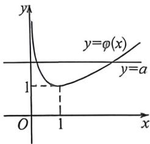

## 考点四_导数的切线恒成立零点问题

## 一、切线方程与切线找点问题

指数切线切点找点: $e^{x-x_{0}}\geqslant x-x_{0}+1$ ,转化为 $e^{x}\geqslant e^{x_{0}}x+e^{x_{0}}(-x_{0}+1)$ .

对数切线切点找点: $\ln\frac{x}{x_{0}}\leqslant\frac{x}{x_{0}}-1$ , 转化为 $\ln x\leqslant\frac{x}{x_{0}}-1+\ln x_{0}$ .

指数切线斜率找点: $e^{x}\geqslant kx+b\Leftrightarrow x_{0}=\ln k,b=k(1-\ln k)$ .

对数切线斜率找点: $\ln x \leqslant kx + b \Leftrightarrow x_{0} = \frac{1}{k}, b = -1 - \ln k.$

根据指数切线斜率找点: $e^{x}\geqslant ax+b\Leftrightarrow x_{0}=\ln a,\quad b=a(1-\ln a)\Leftrightarrow ab=-a^{2}\ln\frac{a}{e}=-\frac{e^{2}}{2}\frac{a^{2}}{e^{2}}\ln\frac{a^{2}}{e^{2}}\leqslant\frac{e}{2}.$

根据对数切线斜率找点： $\ln x\leqslant ax + b\Leftrightarrow x_0 = \frac{1}{a}$ ， $b = -1 - \ln a\Leftrightarrow ab = -a(1 + \ln a) = -\frac{1}{e} ae\ln ae\leqslant \frac{1}{e^2}$

![[高中/总复习/二轮/2026版高中《MST新思路思维拓展》二轮复习专题/上册/函数与导数小题篇/考点四_导数的切线恒成立零点问题/questions/Q00093291.md]]
![[高中/总复习/二轮/2026版高中《MST新思路思维拓展》二轮复习专题/上册/函数与导数小题篇/考点四_导数的切线恒成立零点问题/questions/Q00092871.md]]
![[高中/总复习/二轮/2026版高中《MST新思路思维拓展》二轮复习专题/上册/函数与导数小题篇/考点四_导数的切线恒成立零点问题/questions/Q00092872.md]]
![[高中/总复习/二轮/2026版高中《MST新思路思维拓展》二轮复习专题/上册/函数与导数小题篇/考点四_导数的切线恒成立零点问题/questions/Q00092873.md]]
![[高中/总复习/二轮/2026版高中《MST新思路思维拓展》二轮复习专题/上册/函数与导数小题篇/考点四_导数的切线恒成立零点问题/questions/Q00092874.md]]

## 二、零点小题参变分离思想与极限分析思想

![[高中/总复习/二轮/2026版高中《MST新思路思维拓展》二轮复习专题/上册/函数与导数小题篇/考点四_导数的切线恒成立零点问题/questions/Q00092875.md]]
![[高中/总复习/二轮/2026版高中《MST新思路思维拓展》二轮复习专题/上册/函数与导数小题篇/考点四_导数的切线恒成立零点问题/questions/Q00092876.md]]
![[高中/总复习/二轮/2026版高中《MST新思路思维拓展》二轮复习专题/上册/函数与导数小题篇/考点四_导数的切线恒成立零点问题/questions/Q00092877.md]]

## M 解50 断题路口进拓展 复习专题 第二和

$2x\ln x+x=x(2\ln x+1)>0$ , 即 $f(x)$ 单调递增; $x\to+\infty$ , $f(x)\to+\infty$ , 当 0<x<1 时, $f'(x)=-2x\ln x-x=-x$ $(2\ln x+1)$ , 令 $f'(x)=0$ , 得 $x=\frac{1}{\sqrt{e}}$ , 当 $x\in\left(0,\frac{1}{\sqrt{e}}\right)$ 时, $2\ln x+1<0$ , $f'(x)>0$ , 即 $f(x)$ 单调递增, 当 $x\in\left(\frac{1}{\sqrt{e}},1\right)$ 时, $2\ln x+1>0$ , $f'(x)<0$ , 即 $f(x)$ 单调递减, 所以 $f(x)$ 在 $x=\frac{1}{\sqrt{e}}$ 处取得极大值, $f\left(\frac{1}{\sqrt{e}}\right)=-\left(\frac{1}{\sqrt{e}}\right)^{2}\ln\frac{1}{\sqrt{e}}=\frac{1}{2e}$ , $f(1)=0$ , 方程 $\frac{a}{x}=|x\ln x|$ 有一个实根, 即函数 $f(x)$ 与函数 y=a 有 1 个不同的交点, 结合图象可得 a=0 或 $a>\frac{1}{2e}$ . 故选: A.

例 (2026 届云甫甄大尉中月考(三)T8)已知函数 $f(x)=\frac{e^{x}-\ln x}{x}$ 与函数 $g(x)=\frac{a}{x}+e^{x}-1$ 的图象有两个不同的交点，则a的取值范围是
A. (0,1) B. (1,+∞)
C. (-∞,0) D. (1,e)

$\text{圆桥} f(x) = g(x)$ 在 $(0, +\infty)$ 有两个不同解，所以 $\frac{e^x - \ln x}{x} = \frac{a}{x} + e^a - 1 \Rightarrow e^x - \ln x = a + xe^a - x,$

即 $e^x + x = \ln x + xe^x + a = \ln x + a + e^{a + \ln x}$ , 令 $h(x) = e^x + x$ , 即 $h(x) = h(a + \ln x)$ , 又 $h'(x) = e^x + 1 > 0$ , 所以 $h(x)$ 在 $(0, +\infty)$ 单调递增, 所以 $x = a + \ln x$ , 即 $a = x - \ln x$ 在 $(0, +\infty)$ 有两个解, 由同构函数即 $a \in (1, +\infty)$ , 故选: B.

![[高中/总复习/二轮/2026版高中《MST新思路思维拓展》二轮复习专题/上册/函数与导数小题篇/考点四_导数的切线恒成立零点问题/questions/Q00093221.md]]
![[高中/总复习/二轮/2026版高中《MST新思路思维拓展》二轮复习专题/上册/函数与导数小题篇/考点四_导数的切线恒成立零点问题/questions/Q00092880.md]]
![[高中/总复习/二轮/2026版高中《MST新思路思维拓展》二轮复习专题/上册/函数与导数小题篇/考点四_导数的切线恒成立零点问题/questions/Q00093222.md]]

## 三、导数极值点零点综合小题

![[高中/总复习/二轮/2026版高中《MST新思路思维拓展》二轮复习专题/上册/函数与导数小题篇/考点四_导数的切线恒成立零点问题/questions/Q00093223.md]]
![[高中/总复习/二轮/2026版高中《MST新思路思维拓展》二轮复习专题/上册/函数与导数小题篇/考点四_导数的切线恒成立零点问题/questions/Q00093292.md]]
![[高中/总复习/二轮/2026版高中《MST新思路思维拓展》二轮复习专题/上册/函数与导数小题篇/考点四_导数的切线恒成立零点问题/questions/Q00092884.md]]
