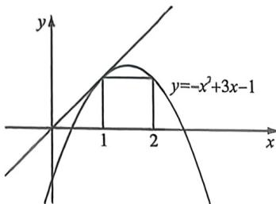

> [!faq]- 例题解析
>
> > [!success]- **【答案】** BCD
>
> > [!note]- **【解析】**
> > 解析 距列 $\{a_{n}\}$ 满足 $a_{n+1}=(a_{n}-1)(a_{n}-2)+2$ ，且 $a_{1}=3$ ，可得 $a_{2}=2\times1+2=4, a_{3}=3\times2+2=8, a_{4}=7\times6+2=44$ ，故 A 错误；
> >
> > 由 $a_{n+1} - a_n = (a_n - 1)(a_n - 2) + 2 - a_n = (a_n - 2)^2 > 0 (a_n \neq 2)$ ，可得 $a_{n+1} - a_n > 0$ ，即 $a_{n+1} > a_n$ ，即数列 $(a_n)$ 单调递增，故 B 正确；
> >
> > 由 $a_{n+1} = (a_n - 1)(a_n - 2) + 2$ ，可得 $\frac{1}{a_{n+1}-2} = \frac{1}{a_n - 2} -\frac{1}{a_n - 1}$ 即 $\frac{1}{a_n - 1} = \frac{1}{a_n - 2} -\frac{1}{a_{n+1} - 2}$ ，可得 $S_{n} = \frac{1}{a_1 - 2} -\frac{1}{a_2 - 2}+$ $\frac{1}{a_2 - 2} -\frac{1}{a_3 - 2} +\dots +\frac{1}{a_n - 2} -\frac{1}{a_{n+1} - 2} = \frac{1}{a_1 - 2} -\frac{1}{a_{n+1} - 2} = 1 - \frac{1}{a_{n+1} - 2}$ 故C正确；
> >
> > 由 $a_{n+1}-2a_{n}=(a_{n}-1)(a_{n}-2)+2-2a_{n}=(a_{n}-1)(a_{n}-4)$ ，可得 $a_{0}=2a_{2}, a_{4}>2a_{3}, a_{6}>2a_{4}, \cdots, a_{2025}>2a_{2024}$ ，即有 $a_{2025}>2^{2025}$ ，故 D 正确，故选：BCD.
> >
> > 例(2024·多迭·福定期中)数列 $\{a_{n}\}$ 满足 $a_{1}=a_{n}a_{n+1}=3a_{n}-a_{n}^{2}-1$ ，则下列说法正确的是（)
> > A. 若 $a \neq 1$ 且 $a \neq 2$ ，数列 $(a_{n})$ 单调递减
> > B. 若存在无数个自然数 n，使得 $a_{n+1}=a_{n}$ ，则 a=1
> >
> > C. 当 a > 2 或 a < 1 时， $(a_{n})$ 的最小值不存在
> >
> > D. 当 a=3 时， $\frac{1}{a_{1}-2}+\frac{1}{a_{2}-2}+\cdots+\frac{1}{a_{n}-2}\in\left(\frac{1}{2},1\right]$
> >
> > 
> >
> > 解析 由 $a_{n+1} = 3a_n - a_n^2 - 1$ ，得 $a_{n+1} - a_n = 2a_n - a_n^2 - 1 = -(a_n - 1)^2$
> >
> > 对于 A, 因为 $a \neq 1$ 且 $a \neq 2$ , 所以 $a_{n+1} - a_n < 0$ , 所以数列 $\{a_n\}$ 单调递减, 故 A 正确;
> >
> > 对于 B, 当 a=1 或 a=2 时, $a_{2}=1$ , 存在无数个自然数 n, 使得 $a_{n+1}=a_{n}$ , 故 B 错误;
> >
> > 对于 C, 当 a > 2 或 a < 1 时, 利用蛛网图可得 $(a_{n})$ 单调递减, 故 $(a_{n})$ 的最小值不存在, 故 C 正确;
> >
> > 对于 D, $a_{1}=a=3$ , $a_{2}=3\times3-3^{2}-1=-1<0$ , 又由以上推理知 $(a_{n})$ 递减, 且唯一不动点 $x_{0}=1$ , 我们利用不动点构造成 $x_{0}-a_{n+1}=1-a_{n+1}=2-3a_{n}+a_{n}^{2}=(1-a_{n})(2-a_{n})$ , 所以 $\frac{1}{1-a_{n+1}}=\frac{1}{2-3a_{n}+a_{n}^{2}}=\frac{1}{1-a_{n}}-\frac{1}{2-a_{n}}$ , $\frac{1}{1-a_{n}}-\frac{1}{1-a_{n+1}}=\frac{1}{2-a_{n}}$ , 裂项相消构造成功, $\frac{1}{a_{1}-2}+\frac{1}{a_{2}-2}+\cdots+\frac{1}{a_{n}-2}=-(\frac{1}{1-a}-\frac{1}{1-a_{n+1}})=\frac{1}{2}+\frac{1}{1-a_{n+1}}>\frac{1}{2}$ , D 正确.
> >
> > 故选 **ACD**.
