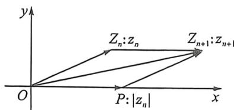
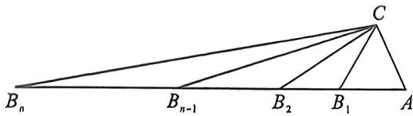

> [!faq]- 例题解析
>
> > [!success]- **【答案】** $a_{n}=\frac{\sqrt{3}}{2\sin\frac{\pi}{3\cdot2^{n-2}}}$
>
> > [!note]- **【解析】**
> > 解析 由 $a_{n+1}^2 = S_n^2 - S_n + 1 = \left(S_n - \frac{1}{2}\right)^2 + \frac{3}{4} (n \in \mathbb{N}^\circ)$ ，且数列 $\langle a_n \rangle$ 为正项数列，
> >
> > 法一(复数构造): 定义复数 $z_{n}=\left(S_{n}-\frac{1}{2}\right)+\frac{\sqrt{3}}{2}i$ ，则 $\left|z_{n}\right|=\sqrt{\left(S_{n}-\frac{1}{2}\right)^{2}+\frac{3}{4}}=a_{n+1}$ ，则有 $z_{n+1}=\left(S_{n+1}-\frac{1}{2}\right)+\frac{\sqrt{3}}{2}i$ $=S_{n}+a_{n+1}-\frac{1}{2}+\frac{\sqrt{3}}{2}i=z_{n}+a_{n+1}=z_{n}+|z_{n}|$ ，又 $z_{1}=a_{1}-\frac{1}{2}+\frac{\sqrt{3}}{2}i=\frac{1}{2}+\frac{\sqrt{3}}{2}i$ ，其对应辐角主值 $\theta_{1}=\frac{\pi}{3}$ ；如图，设复数 $z_{n}$ 对应复平面内的点 $Z_{n}$ ，复数 $z_{n+1}$ 对应复平面内的点 $Z_{n+1}$ ，则 $\left|z_{n}\right|$ 对应复平面内的实轴上的点 P，且 $\left|OP\right|=|z_{n}|=\left|OZ_{n}\right|$ ，由 $z_{n+1}=z_{n}+|z_{n}|$ ，根据复数加法的几何意义可知 $\overrightarrow{OZ_{n+1}}=\overrightarrow{OZ_{n}}+\overrightarrow{OP}$ ，故四边形 $OPZ_{n+1}Z_{n}$ 为菱形，即复数 $z_{n+1}$ 对应辐角主值 $\theta_{n+1}=\frac{1}{2}\theta_{n}$ ;
> >
> > 
> >
> > 故数列 $\{\theta_{n}\}$ 是以 $\frac{\pi}{3}$ 为首项， $\frac{1}{2}$ 为公比的等比数列，所以 $\theta_{n} = \frac{\pi}{3 \cdot 2^{n-1}}$ ，且 $\frac{\sqrt{3}}{2} = |z_{n}| \sin \theta_{n}$ ，
> >
> > 故 $a_{n+1} = |z_n| = \frac{\sqrt{3}}{2\sin\theta_n} = \frac{\sqrt{3}}{2\sin\frac{\pi}{3\cdot 2^{n-1}}}$ , 则 $a_n = \frac{\sqrt{3}}{2\sin\frac{\pi}{3\cdot 2^{n-2}}}, n \geqslant 2, n \in \mathbf{N}^n$ 当 $n=1$ 时，又 $a_1 = \frac{\sqrt{3}}{2\sin\frac{\pi}{3\cdot 2^{1-2}}} = \frac{\sqrt{3}}{2\sin\frac{2\pi}{3}} =$
> >
> >
> > 1 也适合上式. 所以 $a_{n} = \frac{\sqrt{3}}{2\sin\frac{\pi}{3\cdot 2^{n - 2}}}, n \in \mathbf{N}^{\circ}$ .
> >
> > 
> >
> > 法二(余弦定理):如图, $a_{1}=1,a_{n+1}^{2}=S_{n}^{2}-S_{n}+1(n\in\mathbf{N}^{\circ})$ ，则构造 $|CB_{n}|=a_{n+1},|AB_{n}|=S_{n},|AC|=1,\angle A=\frac{\pi}{3}$ ，故 $a_{n+1}^{2}=S_{n}^{2}+1-2\times1\times S_{n}\times\cos\frac{\pi}{3}=S_{n}^{2}-S_{n}+1(n\in\mathbf{N}^{\circ})$ ，符合题意构造，设 $\angle AB_{n}C=\theta_{n}$ ，其中 $\theta_{1}=\frac{\pi}{3}$ ，由于 $a_{2}=$ $|CB_{1}|=|B_{1}B_{2}|,a_{n}=|CB_{n-1}|=|B_{n-1}B_{n}|$ ，则 $\angle AB_{n}C=\angle B_{n-1}CB_{n}=\theta_{n},n\geqslant2$ ，则 $\theta_{n}=\frac{1}{2}\theta_{n-1}$ ，则数列 $\{\theta_{n}\}$ 是以 $\frac{\pi}{3}$ 为首项，以 $\frac{1}{2}$ 为公比的等比数列，则 $\theta_{n-1}=\frac{\pi}{3}\times\left(\frac{1}{2}\right)^{n-2}=\frac{\pi}{3\cdot2^{n-2}},\frac{a_{n}}{\sin A}=\frac{|AC|}{\sin\angle AB_{n-1}C}\Rightarrow a_{n}=\frac{\sqrt{3}}{2\sin\frac{\pi}{3\cdot2^{n-2}}}$ 故答案为： $a_{n}=\frac{\sqrt{3}}{2\sin\frac{\pi}{3\cdot2^{n-2}}}$
