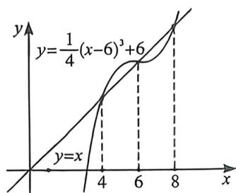
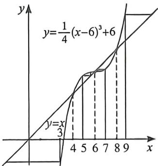

> [!faq]- 例题解析
>
> > [!success]- **【答案】** B
>
> > [!note]- **【解析】**
> > 解析 法一: 对原式进行变形, 得 $a_{n+1}-a_{n}=\left[\frac{1}{4}(a_{n}-6)^{2}-1\right](a_{n}-6)$ ,
> >
> > $$
> > a _ {1} = 3
> > $$
> >
> > $$
> > a _ {2} - a _ {1} <   0, a _ {2} <   3
> > $$
> >
> > $$
> > a _ {k} <   3 (k \in Z, k \geqslant 2)
> > $$
> >
> > $$
> > a _ {k + 1} - a _ {k} <   - 3
> > $$
> >
> > $$
> > \{a _ {n} \}
> > $$
> >
> > $$
> > n \rightarrow + \infty , a _ {n} \rightarrow - \infty , A
> > $$
> >
> > 当 $a_1 = 5$ ，则 $a_2 - a_1 > 0$ ，即 $a_2 > 5$ ，又因为 $\frac{1}{4} (a_1 - 6)^3 < 0$ ，所以 $5 < a_2 < 6$
> >
> > 假设 $5 < a_{k} < 6 (k \in \mathbb{Z}, k \geqslant 2)$ ，则 $a_{k+1} - a_{h} > 0$ ，即 $a_{k+1} > 5$ ，又因为 $\frac{1}{4} (a_{k} - 6)^{3} < 0$ ，所以 $5 < a_{k+1} < 6$
> >
> > 所以当 $n \to +\infty, a_n \to 6, \mathrm{B}$ 正确，对于C，当 $a_1 = 7$ ，递减数列，通过计算发现无穷接近6，所以 $M = 6, \mathrm{C}$ 错误，法二：作蛛网图如左下，有三个不动点，4,6,8，
> >
> > 
> >
> > 
> >
> > 如右上图，当 $a_1 = 3$ ，则 $\{a_n\}$ 是递减数列，且当 $n \to +\infty, a_n \to -\infty, A$ 错误，
> >
> >
> > 当 $a_1 = 5, (a_\circ)$ 是递增数列，根据蛛网图可得 $\lim_{n\to \infty}a_n = 6$ ，B正确，
> >
> > 若 $a_{1} = 7$ ，则 $(a_{0})$ 是递减数列，根据蛛网图可得 $\lim_{n\to \infty}a_n = 6$ ，不存在 $M > 6$ ，C错误，
> >
> > 若 $a_1 = 9$ ，则 $(a_{\circ})$ 是递增数列，根据蛛网图可得当 $n\to +\infty a_n\to +\infty ,D$ 错误，
> >
> > 故选 **B**.
