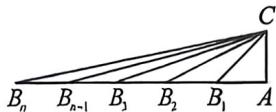

> [!faq]- 例题解析
>
> > [!success]- **【答案】** ①②④
>
> > [!note]- **【解析】**
> > $$
> > - **③**：\forall n \in \mathbf {N} ^ {\circ}, f (n) + f (n + 2) <   2 f (n + 1);
> > - **④**：\forall n \in \mathbf {N} ^ {\circ}, f (n + 1) = 2 f (n) \cos \frac {\pi}{2 ^ {n + 1}}
> > $$
> >
> > 其中所有正确结论的序号是
> >
> > 解析 对于①. 因 $f(n + 1) = \sqrt{S_n^2 + 1}$ ，则 $f^2 (n + 1) = S_n^2 + 1^2$ ，则长度分别为 $1, f(n + 1), S_n$ 的三条线段可以构成一个直角三角形，故①正确；
> >
> > 
> > - **对于②**：, 因 $S_{n} = f(1) + f(2) + \cdots + f(n)$ , 则 $n \geqslant 2$ 时, $f(n) = S_{n} - S_{n-1}$ , 因 $f(1) = 1$ 以及 $f(n+1) = \sqrt{S_{n}^{2} + 1}$ 可知 $f(n) > 0, S_{n} > 0$ , 下用数学归纳法证明 $\forall n \in \mathbb{N}^{\circ}, S_{n} \geqslant 2^{n-1}$ , 当 $n = 1$ 时, $S_{1} \geqslant 2^{0}$ , 满足关系式;
> >
> > 假设当 $n = k \in \mathbf{N}^{\circ}$ 时， $S_{k} \geqslant 2^{k - 1}$ 成立，则当 $n = k + 1$ 时， $S_{k + 1} = S_{k} + f(k + 1) = S_{k} + \sqrt{S_{k}^{2} + 1} > S_{k} + \sqrt{S_{k}^{2}} = 2S_{k} = 2^{k}$ ，则当 $n = k + 1$ 时， $S_{n} \geqslant 2^{n - 1}$ 成立，综上可知， $\forall n \in \mathbf{N}^{\circ}, S_{n} \geqslant 2^{n - 1}$ ，故②正确；
> > - **对于③**：，因 $f(1) = 1$ 以及 $f(n + 1) = \sqrt{S_n^2 + 1}$ ，则 $f(2) = \sqrt{S_1^2 + 1} = \sqrt{2}, S_2 = 1 + \sqrt{2}$ ，
> >
> > $f(3) = \sqrt{S_2^2 + 1} = \sqrt{4 + 2\sqrt{2}}$ ，则 $f(1) + f(3) = 1 + \sqrt{4 + 2\sqrt{2}} > 2f(2) = 2\sqrt{2}$ ，故③错误；
> > - **对于④**：,由①可知,长度分别为 $1, f(n + 1), S_{n}$ 的三条线段可以构成一个直角三角形,
> >
> > 设 Rt△CAB $_n$ ，其中 CA=f(1)=1, AB $_n$ = S $_n$ ，CB $_n$ = f(n+1)，则 B $_n$ B $_{n+1}$ = AB $_{n+1}$ - AB $_n$ = S $_{n+1}$ - S $_n$ = f(n+1) = CB $_n$ ，CA=AB $_1$ = 1，设 ∠AB $_n$ C = θ $_n$ ，其中 θ $_1$ = $\frac{\pi}{4}$ ，则 ∠AB $_n$ C = ∠B $_{n-1}$ CB $_n$ = θ $_n$ ，n ≥ 2，则 ∠AB $_n$ C = ∠AB $_{n+1}$ C +
> >
> >
> > $\angle B_{n}CB_{n+1}=2\angle AB_{n+1}C$ ，即 $\theta_{n+1}=\frac{1}{2}\theta_{n}$ ，则数列 $\langle\theta_{n}\rangle$ 是以 $\frac{\pi}{4}$ 为首项，以 $\frac{1}{2}$ 为公比的等比数列，则 $\theta_{n}=\frac{\pi}{4}\times\left(\frac{1}{2}\right)^{n-1}=\frac{\pi}{2^{n+1}}$ ，在 Rt $\triangle CAB_{n}$ 中， $CB_{n}=\frac{1}{\sin\theta_{n}}=\frac{1}{\sin\frac{\pi}{2^{n+1}}}$ ，即 $f(n+1)=\frac{1}{\sin\frac{\pi}{2^{n+1}}}$ ， $n\in\mathbb{N}^{\circ}$ ，则 $(n)=\frac{1}{\sin\frac{\pi}{2^{n}}}$ ， $n\geqslant2$ ，因 $f(1)=1$ 符合上式，故 $f(n)=\frac{1}{\sin\frac{\pi}{2^{n}}}$ ， $n\in\mathbb{N}^{\circ}$ ，则 $\because f(n)\cos\frac{\pi}{2^{n+1}}=\frac{2\cos\frac{\pi}{2^{n+1}}}{\sin\frac{\pi}{2^{n}}}=\frac{2\cos\frac{\pi}{2^{n+1}}\sin\frac{\pi}{2^{n+1}}}{\sin\frac{\pi}{2^{n}}\sin\frac{\pi}{2^{n+1}}}=\frac{\sin\frac{\pi}{2^{n}}}{\sin\frac{\pi}{2^{n}}\sin\frac{\pi}{2^{n+1}}}=\frac{1}{\sin\frac{\pi}{2^{n+1}}}$ ，则 $\forall n\in\mathbb{N}^{\circ}$ ， $f(n+1)=2f(n)\cos\frac{\pi}{2^{n+1}}$ ，故④正确。故答案为：①②④
