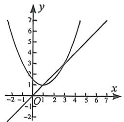
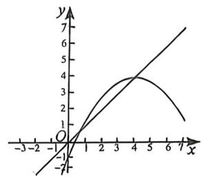
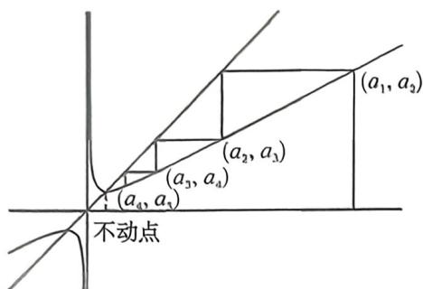
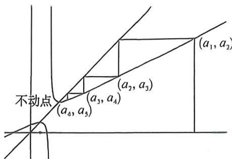
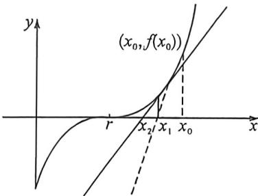

## 考点五_二次函数数列的通项与放缩

## 一、不动点在二次函数顶点可求通项型

$$
a _ {n + 1} = a a _ {n} ^ {2} + b a _ {n} + c (b ^ {2} - 4 a c = 2 b)
$$

法一：迭代： $a_{n + 1} + \frac{b}{2a} = a(a_n + \frac{b}{2a})^2 = a[a(a_{n - 1} + \frac{b}{2a})^2]^2 = a^3(a_{n - 1} + \frac{b}{2a})^{2^2} = \dots =$

$$
a ^ {1 + 2 + \dots + 2 ^ {n - 1}} \left(a _ {1} + \frac {b}{2 a}\right) ^ {2 ^ {n}}
$$

$$
a _ {n} = a ^ {1 + 2 + \dots + 2 ^ {n - 2}} \left(a _ {1} + \frac {b}{2 a}\right) ^ {2 ^ {n - 1}} - \frac {b}{2 a} = a ^ {2 ^ {n - 1} - 1} \left(a _ {1} + \frac {b}{2 a}\right) ^ {2 ^ {n - 1}} - \frac {b}{2 a}
$$

法二:两边取对数得: $\ln\left(a_{n+1}+\frac{b}{2a}\right)=\ln a+2\ln\left(a_{n}+\frac{b}{2a}\right)\Rightarrow\ln\left(a_{n+1}+\frac{b}{2a}\right)+\ln a=2\left[\ln\left(a_{n}+\frac{b}{2a}\right)+\ln a\right]$

所以 $\ln \left(a_{n} + \frac{b}{2a}\right) + \ln a = 2^{n - 1}\left[\ln \left(a_{1} + \frac{b}{2a}\right) + \ln a\right] \Rightarrow a\left(a_{n} + \frac{b}{2a}\right) = a^{2^{n - 1}}\left(a_{1} + \frac{b}{2a}\right)^{2^{n - 1}} \Rightarrow a_{n}$ $a^{2^{n - 1} - 1}\left(a_{1} + \frac{b}{2a}\right)^{2^{n - 1}}$

所以 $\ln \left(a_{n} + \frac{b}{2a}\right) + \ln a = 2^{n - 1}\left[\ln \left(a_{1} + \frac{b}{2a}\right) + \ln a\right] \Rightarrow a\left(a_{n} + \frac{b}{2a}\right) = a^{2^{n - 1}}\left(a_{1} + \frac{b}{2a}\right)^{2^{n - 1}} \Rightarrow a_{n} =$ $a^{2^{n - 1} - 1}\left(a_{1} + \frac{b}{2a}\right)^{2^{n - 1}}$

$$
y = a (x - h) ^ {2} + h (a > 0)
$$

$$
y = a (x - h) ^ {2} + h (a <   0)
$$

顶点为不动点抛物线

顶点为不动点的抛物线

$$
\lim _ {n \rightarrow \infty} a _ {n} = h
$$

$$
\lim _ {n \rightarrow \infty} a _ {n} = h
$$

![[高中/总复习/二轮/2026版高中《MST新思路思维拓展》二轮复习专题/上册/数列/考点五_二次函数数列的通项与放缩/questions/Q00093107.md]]
![[高中/总复习/二轮/2026版高中《MST新思路思维拓展》二轮复习专题/上册/数列/考点五_二次函数数列的通项与放缩/questions/Q00093347.md]]
![[高中/总复习/二轮/2026版高中《MST新思路思维拓展》二轮复习专题/上册/数列/考点五_二次函数数列的通项与放缩/questions/Q00093323.md]]

## 平方式可裂项递推型 $a_{n + 1} = a\cdot a_{n + 1}^2 +b\cdot a_n + c$ （唯一不动点切点）

若 $f(x) = ax^{2} + bx + c$ 有两个不动点，当且仅当一个不动点在顶点时，即 $b^{2} - 4ac = 2b$ ，则一定有： $a_{n+1} + \frac{b}{2a} = a\left(a_{n} + \frac{b}{2a}\right)^{2}$ ，此时属于可求通项的递推模型，例如 $a_{n+1} = a_{n}^{2} + 2a_{n} \Leftrightarrow a_{n+1} + 1 = (a_{n} + 1)^{2}$ ，此模型就是由 $(x) = x^{2} + 2x = x$ ，不动点为 $a = -1, \beta = 0$ ，且 $(-1, -1)$ 为 $f(x)$ 的顶点，故能完成平方式递推；

若 $f(x) = ax^{2} + bx + c$ 仅有一个不动点 $x_{0}$ , 且不动点不在顶点时, 则一定有: $\frac{1}{a_{n+1} - x_{0}} = \frac{1}{a_{n} - x_{0}} - \frac{1}{a_{n} - m}$ , 此时属于可直接裂项相消求通项模型, 例如 $a_{n+1} = a_{n}^{2} + a_{n} \Leftrightarrow \frac{1}{a_{n+1}} = \frac{1}{a_{n}} - \frac{1}{a_{n} + 1}$ , 此模型就是由于 $f(x) = x^{2} + x = x$ , 不动点为 $x_{0} = 0$ , 且 $(0,0)$ 不是 $f(x)$ 的顶点, 故能完成裂项递推, 我们做一下总结:

$$
① a _ {n + 1} = a _ {n} (a _ {n} + 1) \Rightarrow \frac {1}{a _ {n + 1}} = \frac {1}{a _ {n}} - \frac {1}{a _ {n} + 1} \Rightarrow \frac {1}{a _ {n} + 1} = \frac {1}{a _ {n}} - \frac {1}{a _ {n + 1}} \Rightarrow \sum_ {i = 1} ^ {n} \frac {1}{a _ {i} + 1} = \frac {1}{a _ {1}} - \frac {1}{a _ {n + 1}}
$$

$$
② a _ {n + 1} = \frac {a _ {n} ^ {2}}{m} + a _ {n} \Rightarrow \frac {a _ {n + 1}}{m} = \frac {a _ {n}}{m} \left(\frac {a _ {n}}{m} + 1\right) \Rightarrow \frac {1}{a _ {n} + m} = \frac {1}{a _ {n}} - \frac {1}{a _ {n + 1}} \Rightarrow \sum_ {i = 1} ^ {n} \frac {1}{a _ {i} + m} = \frac {1}{a _ {1}} - \frac {1}{a _ {n + 1}}
$$

$$
③ a _ {n + 1} = a _ {n} ^ {2} - a _ {n} + 1 \Rightarrow \frac {1}{a _ {n + 1} - 1} = \frac {1}{a _ {n} - 1} - \frac {1}{a _ {n}} \Rightarrow \frac {1}{a _ {n}} = \frac {1}{a _ {n} - 1} - \frac {1}{a _ {n + 1} - 1} \Rightarrow \sum_ {i = 1} ^ {n} \frac {1}{a _ {i}} = \frac {1}{a _ {1} - 1} - \frac {1}{a _ {n + 1} - 1}
$$

$$
④ a _ {n + 1} = \frac {a _ {n}}{k a _ {n} ^ {2} + 1} \Rightarrow \frac {1}{a _ {n + 1}} - \frac {1}{a _ {n}} = k a _ {n} \Rightarrow \sum_ {i = 1} ^ {n} a _ {i} = \frac {1}{k} \left(\frac {1}{a _ {n + 1}} - \frac {1}{a _ {1}}\right)
$$

![[高中/总复习/二轮/2026版高中《MST新思路思维拓展》二轮复习专题/上册/数列/考点五_二次函数数列的通项与放缩/questions/Q00093110.md]]

## 三、牛顿法与平方式递推

关于平方式的递推 $a_{n + 1} = \frac{a_n^2 + p}{2a_n + q} (q^2 +4p\neq 0)$

将 $a_{n + 1} = \frac{a_n^2 + p}{2a_n + q}$ 变成 $\frac{a_{n + 1} - \alpha}{\alpha_{n + 1} - \beta} = \left(\frac{a_n - \alpha}{a_n - \beta}\right)^2$ 因为 $\frac{a_{n + 1} - \alpha}{a_{n + 1} - \beta} = \frac{\frac{a_n^2 + p}{2a_n + q} - \alpha}{\frac{a_n^2 + p}{2a_n + q} - \beta} = \frac{a_n^2 - 2\alpha a_n + p - \alpha q}{a_n^2 - 2\beta a_n + p - \beta q} = \left(\frac{a_n - \alpha}{a_n - \beta}\right)^2$

则有 $\left\{\begin{aligned}p-\alpha q&=\alpha^{2}\\ p-\beta q&=\beta^{2}\end{aligned}\right.$ 所以 $\alpha,\beta$ 是方程 $x^{2}+qx-p=0$ 的两根，所以 $\alpha,\beta$ 是方程 $x=\frac{x^{2}+p}{2x+q}$ 的两根。

(1) 迭代法, 先求出 $\alpha, \beta, \frac{a_n - \alpha}{a_n - \beta} = \left(\frac{a_{n-1} - \alpha}{a_{n-1} - \beta}\right)^2 = \left[\left(\frac{a_{n-1} - \alpha}{a_{n-1} - \beta}\right)^2\right]^2 = \cdots = \left(\frac{a_1 - \alpha}{a_1 - \beta}\right)^{2^{n-1}}$ 所以 $a_n = \frac{\alpha - \beta\left(\frac{a_1 - \alpha}{a_1 - \beta}\right)^{2^{n-1}}}{1 - \left(\frac{a_1 - \alpha}{a_1 - \beta}\right)^{2^{n-1}}}$

(2)对数代换法: $\ln\frac{a_{n+1}-\alpha}{a_{n+1}-\beta}=2\ln\frac{a_{n}-\alpha}{a_{n}-\beta}$ 所以 $\left\{\ln\frac{a_{n}-\alpha}{a_{n}-\beta}\right\}$ 是以 $\ln\frac{a_{1}-\alpha}{a_{1}-\beta}$ 为首项,2为公比的等比数列

$\ln \frac{a_n - \alpha}{a_n - \beta} = 2^{n-1}\ln \frac{a_1 - \alpha}{a_1 - \beta} = \ln \left(\frac{a_1 - \alpha}{a_1 - \beta}\right)^{2^{n-1}}$ 所以 $\frac{a_n - \alpha}{a_n - \beta} = \left(\frac{a_1 - \alpha}{a_1 - \beta}\right)^{2^{n-1}}$ 所以 $a_n = \frac{\alpha - \beta\left(\frac{a_1 - \alpha}{a_1 - \beta}\right)^{2^{n-1}}}{1 - \left(\frac{a_1 - \alpha}{a_1 - \beta}\right)^{2^{n-1}}}$

(3)蛛网图分析

$a_{n + 1} = \frac{a_n^2 + p}{2a_n + q} = \frac{1}{2}\left(\frac{a_n^2 + qa_n + \frac{q^2}{4} - qa_n - \frac{q^2}{4} + p}{a_n + \frac{q}{2}}\right) = \frac{1}{2}\left(a_n + \frac{q}{2}\right) - \frac{q}{2} +\frac{p + \frac{q^2}{4}}{2a_n + q},$ 即不动点为 $\left(-\frac{q}{2}\pm$

$\sqrt{p + \frac{q^2}{4}}, -\frac{q}{2} \pm \sqrt{p + \frac{q^2}{4}}$ ，为方程 $x^2 + qx - p = 0$ 的两根，

结论: $x_{0}<a_{n+1}<a_{n}<a_{n-1}<\cdots<a_{2}<a_{1}$ (若 $a_{1}>x_{0}$ (大不动点), 思考: 当 $a_{1}<x_{0}$ (小不动点) 时, 分析 $\{a_{n}\}$ 单调变化。

(4)切线法与“牛顿数列”

切线法:用曲线弧一端的切线来代替曲线弧,从而求出方程实根的近似值.这种方法叫做“切线法”.由图可得,在点 $(x_{0},f(x_{0}))$ 处做切线 $y-f(x_{0})=f'(x_{0})(x-x_{0})$ ,令y=0,就得到切线与x轴交点的横坐标为 $x_{1}=x_{0}-\frac{f(x_{0})}{f'(x_{0})}$ ,显然 $x_{1}$ 比 $x_{0}$ 更接近方程的根r.同理可得:在点 $(x_{1},f(x_{1}))$ 处做切线,可得根的近似值 $x_{2}$ ;由此递推,在点 $(x_{n},f(x_{n}))$ 处作切线,得根的近似值 $x_{n+1}=x_{n}-\frac{f(x_{n})}{f'(x_{n})}$

牛顿数列:若数列 $\{x_{n}\}$ 的通项关系满足 $x_{n+1}=x_{n}-\frac{f(x_{n})}{f'(x_{n})}$ ，则称数列 $\{x_{n}\}$ 为函数 $f(x)$ 的牛顿数列

若 $f(x) = ax^{2} + bx + c$ ，则牛顿数列通项是一个完全平方式递推。

![[高中/总复习/二轮/2026版高中《MST新思路思维拓展》二轮复习专题/上册/数列/考点五_二次函数数列的通项与放缩/questions/Q00093196.md]]

## 四、由二倍角构造的递推

形如 $a_1 \in [-1, 1]$ , 且 $a_{n+1} = 2a_n^2 - 1$ 时, 不妨令 $a_n = \cos b_n, a_{n+1} = \cos 2b_n = \cos b_{n+1}$ , 可以利用 $a_1a_2 \cdots a_n = \frac{\sin b_1\cos b_1\cos b_2 \cdots \cos b_n}{\sin b_1} = \frac{1}{2^n} \frac{\sin b_{n+1}}{\sin b_1}$ ;

![[高中/总复习/二轮/2026版高中《MST新思路思维拓展》二轮复习专题/上册/数列/考点五_二次函数数列的通项与放缩/questions/Q00093113.md]]
![[高中/总复习/二轮/2026版高中《MST新思路思维拓展》二轮复习专题/上册/数列/考点五_二次函数数列的通项与放缩/questions/Q00093348.md]]

## 五、由余弦定理构造的数列递推

![[高中/总复习/二轮/2026版高中《MST新思路思维拓展》二轮复习专题/上册/数列/考点五_二次函数数列的通项与放缩/questions/Q00093197.md]]
![[高中/总复习/二轮/2026版高中《MST新思路思维拓展》二轮复习专题/上册/数列/考点五_二次函数数列的通项与放缩/questions/Q00093349.md]]
![[高中/总复习/二轮/2026版高中《MST新思路思维拓展》二轮复习专题/上册/数列/考点五_二次函数数列的通项与放缩/questions/Q00093119.md]]
