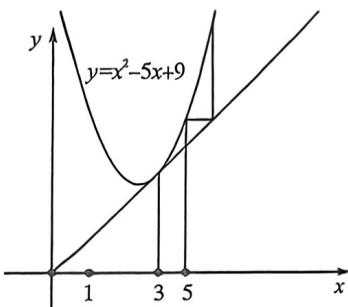

<!-- question-source:start -->
例54 (2025·多选·大连模拟)设数列 $\{a_{n}\}$ 满足 $a_{n+1} = a_{n}^{2} - 5a_{n} + 9, a_{1} = 5$ , 记数列 $\left\{\frac{1}{a_n - 2}\right\}$ 的前 $n$ 项和为 $S_{n}$ , 则

A. $a_{n + 1} > a_n$

B. $\frac{1}{a_5} < \frac{1}{1806 \cdot 1807}$

C. $\alpha_{2025} \leqslant \frac{5}{2} + \left(\frac{5}{2}\right)^{2025}$

D. $S_{\pi} < \frac{1}{2}$
<!-- question-source:end -->

![[高中/总复习/二轮/2026版高中《MST新思路思维拓展》二轮复习专题/上册/数列/考点六_蛛网图与数列放缩的精度/questions/answers/Q00093122A1.md]]
