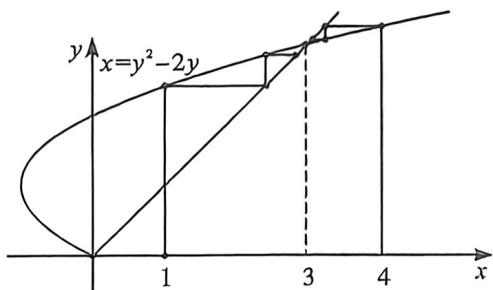

<!-- question-source:start -->
例56 (2025·通州区期末)已知数列 $\{a_{n}\}$ 的各项均为正数, 其前 $n$ 项和为 $S_{n}$ , 且 $a_{n} = a_{n+1}^{2} - 2a_{n+1}$ , 下列说法正确的是 ( )
A. 当 $a_{1} = 1$ 时, 数列 $\{a_{n}\}$ 为递减数列 B. 数列 $\{a_{n}\}$ 不可能为等比数列 C. 当 $a_{1} > 4, \forall n \geqslant 2$ , 都有 $3n < S_{n} < na_{1}$ D. 当 $a_{1} = 1$ 时, $\exists m \in \mathbb{N}^{*}, \forall n > m$ , 都有 $a_{n} > 4$

<!-- question-source:end -->

![[高中/总复习/二轮/2026版高中《MST新思路思维拓展》二轮复习专题/上册/数列/考点六_蛛网图与数列放缩的精度/questions/answers/Q00093124A1.md]]
