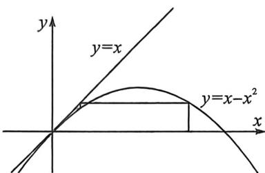
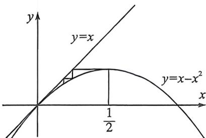

<!-- question-source:start -->
例57 (2025·北京九月月考)已知数列 $\{a_{n}\}$ 满足 $a_{n+1} = a_{n}(1 - a_{n})(n \in \mathbb{N}^{\circ})$ ，且 $0 < a_{1} < 1$ . 给出下列四个结论：

① $a_{2}>\frac{1}{4}$ ; ② $a_{1}+a_{2}+a_{3}+\cdots+a_{n}<\frac{n+3}{4}$ ; ③ $\forall m,n\in N^{*}$ ，当n>m时， $a_{n}>a_{m}$ ; ④ $\forall k\in N^{*}$ ， $\exists m\in N^{*}$ ，当 $n\geqslant m$ 时， $a_{n}<\frac{1}{k}$ .其中所有正确结论的个数为
A. 1 B. 2 C. 3 D. 4

<!-- question-source:end -->

![[高中/总复习/二轮/2026版高中《MST新思路思维拓展》二轮复习专题/上册/数列/考点六_蛛网图与数列放缩的精度/questions/answers/Q00093125A1.md]]
