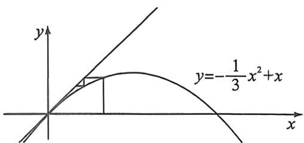
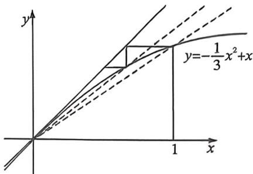

<!-- question-source:start -->
例65 (2022·浙江)已知数列 $\{a_{n}\}$ 满足 $a_1 = 1, a_{n+1} = a_n - \frac{1}{3} a_n^2 (n \in \mathbb{N}^*)$ ，则
A. $2 < 100a_{100} < \frac{5}{2}$ B. $\frac{5}{2} < 100a_{100} < 3$ C. $3 < 100a_{100} < \frac{7}{2}$ D. $\frac{7}{2} < 100a_{100} < 4$

<!-- question-source:end -->

![[高中/总复习/二轮/2026版高中《MST新思路思维拓展》二轮复习专题/上册/数列/考点六_蛛网图与数列放缩的精度/questions/answers/Q00093136A1.md]]
