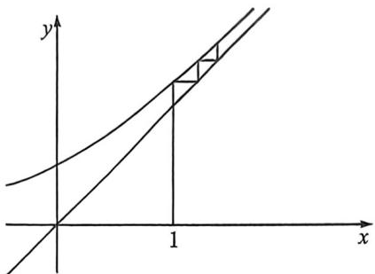
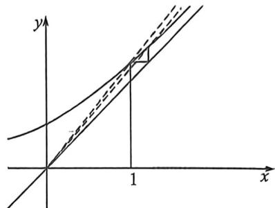

<!-- question-source:start -->
例60 (2024·多选·吉安期末)已知首项为1的正项数列 $\{a_{n}\}$ 满足 $4a_{n+1}^{2}-1=4a_{n+1}a_{n}$ , 则下列说法正确的

是

(

A. $\{a_{n}\}$ 为递增数列 B. $\frac{1}{a_8^2} >\frac{1}{a_7^2}$ C. $a_{2025}^{2} - a_{2024}^{2} <   \frac{1}{2}$ D. 数列 $\{a_{n + 1} - a_n\}$ 为递减数列

<!-- question-source:end -->

![[高中/总复习/二轮/2026版高中《MST新思路思维拓展》二轮复习专题/上册/数列/考点六_蛛网图与数列放缩的精度/questions/answers/Q00093200A1.md]]
