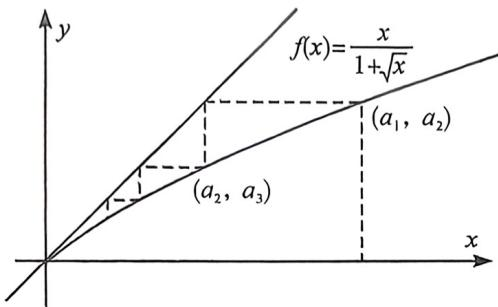

<!-- question-source:start -->
例2 (2021·浙江)已知数列 $\{a_{n}\}$ 满足 $a_{1} = 1, a_{n+1} = \frac{a_{n}}{1 + \sqrt{a_{n}}} (n \in \mathbb{N}^{\circ})$ . 记数列 $\{a_{n}\}$ 的前 $n$ 项和为 $S_{n}$ , 则 ( )
A. $\frac{3}{2} < S_{100} < 3$ B. $3 < S_{100} < 4$ C. $4 < S_{100} < \frac{9}{2}$ D. $\frac{9}{2} < S_{100} < 5$

解得 $\frac{x}{1 + \sqrt{x}}$ ，解得 $x = 0$ ，易知数列 $\{a_n\}$ 的不动点为 $0, 0 < a_{n+1} < a_n < 1$ ，则 $\frac{a_{n+1}}{a_n} = \frac{1}{1 + \sqrt{a_n}} \in \left(\frac{1}{2}, 1\right)$ ，或者 $f'$ (0) $= 1 > \frac{a_{n+1}}{a_n} > \frac{a_n}{a_{n-1}} > \cdots > \frac{a_2}{a_1} = \frac{1}{2}$ ，其中 $a_2 = \frac{1}{2}, \left(\frac{\sqrt{2}}{2} + 1\right)\sqrt{a_n} < \sqrt{a_{n+1}} + \sqrt{a_n} < 2\sqrt{a_n}$ ，

由于 $f(x) = \frac{x}{1 + \sqrt{x}} >\frac{x}{2}$ 对 $x\in (0,1)$ 恒成立，故 $a_{n}\geqslant \frac{1}{2^{n - 1}}$ ，可知 $S_{100} > 1 + \frac{1}{2} = \frac{3}{2},a_{100}\geqslant \frac{1}{2^{99}}$
<!-- question-source:end -->

![[高中/总复习/二轮/2026版高中《MST新思路思维拓展》二轮复习专题/上册/数列/考点六_蛛网图与数列放缩的精度/questions/answers/Q00093277A1.md]]
