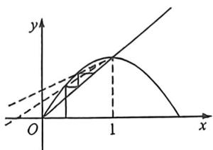
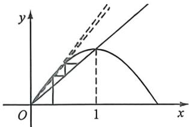

> [!faq]- 例题解析
>
> > [!success]- **【答案】** BCD
>
> > [!note]- **【解析】**
> > 解析 如下图左, 根据蛛网图可知 $\frac{1}{3} \leqslant a_1 < a_2 < \cdots < a_n < a_{n+1} < 1$ , A 错; B 正确; 由于 $f(x) = \sin \frac{\pi}{2} x, f''(x) < 0$ , 故 $f(x)$ 为上凸函数, 针对 $C, \frac{\frac{1}{2}-1}{\frac{1}{3}-1} = \frac{3}{4} \geqslant \frac{a_2 - 1}{a_1 - 1} > \frac{a_3 - 1}{a_2 - 1} > \cdots > \frac{a_{n+1} - 1}{a_n - 1} > 0$ , 所以 $1 - a_{n+1} < \frac{3}{4}(1 - a_n)$ , C 正确;
> >
> > 
> >
> > 
> >
> > 针对 D，如右图， $\frac{\frac{1}{2}}{\frac{1}{3}}=\frac{3}{2}\geqslant\frac{a_{2}}{a_{1}}>\frac{a_{3}}{a_{2}}>\cdots>\frac{a_{n+1}}{a_{n}}>1$ ，所以 $a_{n+1}\leqslant\frac{3}{2}a_{n}$ ，由 $2a_{n+1}\leqslant2a_{1}+S_{n}$ 得， $2a_{n}\leqslant2a_{1}+S_{n-1}$ ，故只需证 $2a_{n+1}-2a_{n}\leqslant a_{n}$ ，显然成立，故 D 正确。
> >
> > 故选 **BCD**.
