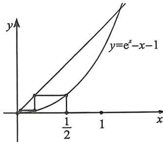

> [!faq]- 例题解析
>
> > [!success]- **【答案】** ACD
>
> > [!note]- **【解析】**
> > 解析 设数列 $\{a_{n}\}$ 的前 $n$ 项和为 $S_{n}, a_{1} = \frac{1}{2}, a_{n+1} = e^{a_{n}} - a_{n} - 1$ ,
> >
> > 对于A选项，因为 $a_1 = \frac{1}{2}$ ，则 $a_2 = e^{a_1} - a_1 - 1 = \sqrt{e} -\frac{3}{2} <  \sqrt{3} -\frac{3}{2} <   \frac{7}{4} -\frac{3}{2} = \frac{1}{4}$ ，故A对；
> > 对于B选项，如蛛网图所示， $\frac{1}{2} = a_1 > a_2 > a_3 > \dots >a_n > a_{n + 1} > 0$ ，所以B错误；
> >
> > 
> >
> > 对于 C 选项, 利用蛛网图, 由于 $f(x) = e^{x} - x - 1$ , $f'(x) = e^{x} - 1 > 0$ , $f''(x) = e^{x} > 0$ , $f'(a_{2}) = e^{\frac{1}{2}} - 1 < \frac{1}{2}$
> >
> > 所以 $\frac{1}{2} > f'(a_2) > \frac{a_3}{a_2} > \frac{a_4}{a_3} > \cdots > \frac{a_{n+1}}{a_n}$ ,
> >
> > 所以 $S_{50} = a_{1} + (a_{2} + a_{3} + \dots +a_{50}) <   \frac{1}{2} +\frac{1}{4}\left[1 + \frac{1}{2} +\dots +\left(\frac{1}{2}\right)^{48}\right] = \frac{1}{2} +\frac{\frac{1}{4}\left[1 - \left(\frac{1}{2}\right)^{49}\right]}{1 - \frac{1}{2}} <  \frac{1}{2} +\frac{1}{2} = 1$ ，故C对；
> >
> > 对于D选项，由 $C$ 选项可知， $a_5 + 5a_3 <   a_2\cdot \left(\frac{1}{2}\right)^3 +5\times \frac{1}{2} a_2 = \frac{21}{8} a_2 <   \frac{21}{8}\times \frac{1}{4} = \frac{21}{32} <  \frac{3}{2} = 3a_{1},$
> >
> > 所以， $a_5 < 3a_1 - 5a_3 = |3a_1 - 5a_3|$ ，故D对.
> >
> > 故选 **ACD**.
