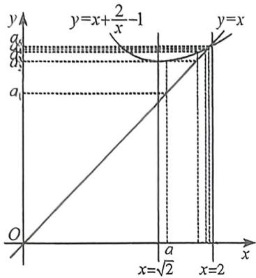
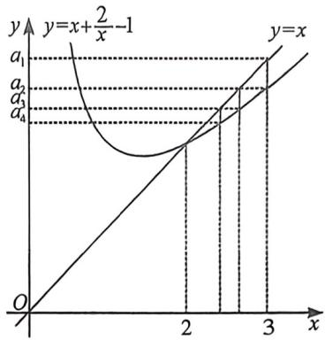
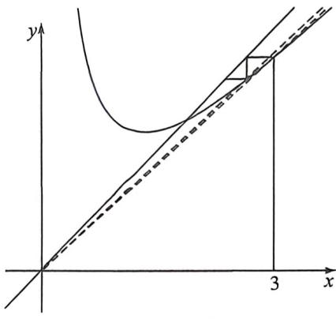

> [!faq]- 例题解析
>
> > [!success]- **【答案】** BCD
>
> > [!note]- **【解析】**
> > 解析 对十 A, 令 $a_{n+1} = a_n + \frac{2}{a_n} - 1 = a_n$ , 解得 $a_n = 2$ , 即数列 $\{a_n\}$ 的不动点为 2, 所以当 $a = 2$ 时, $a_n = 2$ , 此时 $\{|a_n - 2|\}$ 为常数列, 故 A 错误;
> >
> > 对于B, 作出函数 $y = f(x) = x + \frac{2}{x} - 1$ 与函数 $y = x$ 的图像如图: $2 < a_{n+1} < a_n \leqslant 3$ , 由图可知B正确;
> >
> > 
> >
> > 
> >
> > 关于 $C$ 我们分别采用一级精度放缩和二级精度放缩进行解读：
> >
> > $f(x) = x + \frac{2}{x} - 1, f'(x) = 1 - \frac{2}{x^2}, f''(x) = \frac{4}{x^3} > 0$ ，故 $\frac{2}{3} = \frac{a_2 - 2}{a_1 - 2} > \frac{a_3 - 2}{a_2 - 2} > \cdots > \frac{a_{n+1} - 2}{a_n - 2} > f'(2) = \frac{1}{2}$ ，或者根据 $a_{n+1} - 2 = a_n + \frac{2}{a_n} - 3 = \frac{a_n^2 - 3a_n + 2}{a_n} = \frac{(a_n - 2)(a_n - 1)}{a_n}, 2 < a_n \leqslant 3$ ，得 $\frac{a_{n+1} - 2}{a_n - 2} = 1 - \frac{1}{a_n}, \frac{1}{2} < 1 - \frac{1}{a_n} \leqslant \frac{2}{3}$ ，
> >
> > 法一(一级等比精度):对于 C, 且 $a_{n+1}-2<(a_{n}-2)\cdot\frac{2}{3}$ , $S_{n}=(a_{1}-2)+(a_{2}$
> >
> > $-2)+\cdots+(a_{n}-2)<1+\frac{2}{3}+\frac{5}{12}+\cdots+\frac{5}{12}\left(\frac{2}{3}\right)^{n-3}<\frac{5}{3}+\frac{\frac{5}{12}}{1-\frac{2}{3}}=\frac{35}{12}$ , 故 C
> >
> > 正确.
> >
> > 法二(二级等比精度):构造差分方程, $a_{n+1}-a_{n}=\frac{2}{a_{n}}-1=\frac{2-a_{n}}{a_{n}}$ ,则 $a_{n}-2=a_{n}(a_{n}-a_{n+1})$ ,由于 $a_{n}(a_{n}-a_{n+1})$ 是不可相消的式子,故需要进行平方式裂项相
> >
> > 
> >
> > 消，即将 $a_{n}(a_{n} - a_{n + 1}) < m(a_{n} + a_{n + 1})(a_{n} - a_{n + 1}) = m(a_{n}^{2} - a_{n + 1}^{2})$ ，如上图，由于 $a_{n} > a_{n + 1}$ ，根据 $f''(x) = \frac{4}{x^3} >0,1 > \frac{a_{n + 1}}{a_n}$ $>\frac{a_n}{a_{n - 1}} >\dots >\frac{a_2}{a_1} = \frac{8}{9}$ 即 $\frac{8}{9} a_n\leqslant a_{n + 1} <   a_n$
> >
> > 得 $2a_{n} > a_{n} + a_{n + 1}\geqslant \frac{17}{9} a_{n},\frac{1}{2} (a_{n} + a_{n + 1}) <   a_{n}\leqslant \frac{9}{17} (a_{n} + a_{n + 1}),\frac{1}{2} (a_{n}^{2} - a_{n + 1}^{2}) <   a_{n}(a_{n} - a_{n + 1})\leqslant \frac{9}{17} (a_{n}^{2} - a_{n + 1}^{2}),$ 所以 $S_{n} = (a_{1} - 2) + (a_{2} - 2) + \dots +(a_{n} - 2)\leqslant \frac{9}{17} [(a_{1}^{2} - a_{2}^{2}) + (a_{2}^{2} - a_{3}^{2}) + \dots +(a_{n}^{2} - a_{n + 1}^{2})] = \frac{9}{17}(9 - a_{n + 1}^{2})$
> >
> > 因为 $a_{n+1} > 2$ ，且当 $n \to +\infty, a_{n+1} \to 2$ ，所以 $S_n < \frac{9}{17}(9-4) = \frac{45}{17}$ ，因为 $\frac{35}{12} > \frac{45}{17}$ ，故 C 正确；
> >
> > 对于 $D, a_{n+1} - 2 > (a_n - 2) \cdot \frac{1}{2}, S_n = (a_1 - 2) + (a_2 - 2) + \cdots + (a_n - 2) \geqslant 1 + \frac{2}{3} + \frac{5}{12} + \cdots + \frac{5}{12} \cdot \left(\frac{1}{2}\right)^{n-3} = \frac{5}{2} - \frac{5}{3 \cdot 2^{n-1}}$ , 故 D 正确. 故选: BCD.
> >
> > 第二类: 若 $a_{n+1}-a_{n}=(pa_{n}+q)\sqrt{a_{n}}$ ，则 $pa_{n}+q=\frac{a_{n+1}-a_{n}}{\sqrt{a_{n}}}$ ，利用二阶导和蛛网图判断 $\sqrt{\frac{a_{n+1}}{a_{n}}}\in(\alpha,\beta)$ ，从而得到次裂项相消式子： $\frac{1}{\alpha+1}\frac{a_{n+1}-a_{n}}{\sqrt{a_{n+1}}+\sqrt{a_{n}}} >pa_{n}+q >\frac{1}{\beta+1}\frac{a_{n+1}-a_{n}}{\sqrt{a_{n+1}}+\sqrt{a_{n}}}$ ;
