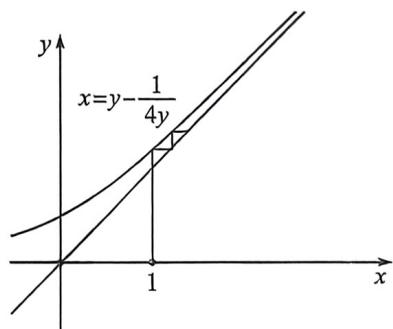

> [!faq]- 例题解析
>
> > [!success]- **【答案】** ACD
>
> > [!note]- **【解析】**
> > 解析 法一: 如左图, $4a_{n+1}^2 - 1 = 4a_{n+1}a_n$ , 利用求根公式得: $a_{n+1} = \frac{a_n + \sqrt{a_n^2 + 1}}{2}$ , 作 $y = f(x) = \frac{x + \sqrt{x^2 + 1}}{2}$ , 易知 $f(x) > x$ , 无不动点, 渐近线为 $y = x$ , $f'(x) = \frac{1}{2} + \frac{x}{2\sqrt{x^2 + 1}}$ , $f''(x) > 0$ ; 故 $1 = a_1 < a_2 < \cdots < a_n$ , 如右图所示, $\frac{\sqrt{2} + 1}{2} = \frac{a_2}{a_1} > \frac{a_3}{a_2} > \cdots > \frac{a_{n+1}}{a_n} = \lim_{x \to +\infty} f'(x) = 1$ (渐近线为 $y = x$ ); 所以数列 $\{a_n\}$ 为递增数列, 可得 $a_{2024} > a_{2023}$ , A 正确; 因为数列 $\{a_n\}$ 为递增数列且 $a_n \geqslant a_1 = 1$ , 则 $\left\{\frac{1}{a_n^2}\right\}$ 为递减数列, B 错误;
> >
> > 法二(反函数迭代):如右图, $4a_{n+1}^{2}-1=4a_{n+1}a_{n}\Rightarrow a_{n}=a_{n+1}-\frac{1}{4a_{n+1}}$ ,构造x=y- $\frac{1}{4y}$ ,易知 $a_{1}<a_{2}<\cdots<a_{n}$ , $\frac{a_{2}}{a_{1}}>\frac{a_{3}}{a_{2}}>\cdots>\frac{a_{n+1}}{a_{n}}=\lim_{x\to+\infty}f'(x)=1$ ;关于选项C,通过整理得 $a_{n}=a_{n+1}-\frac{1}{4a_{n+1}}$ ,所以 $a_{n+1}-a_{n}=\frac{1}{4a_{n+1}}$ ,由于 $\frac{\sqrt{2}+1}{2}\geqslant\frac{a_{n+1}}{a_{n}}>1$ ,故 $(a_{n+1}-a_{n})(a_{n+1}+a_{n})=\frac{a_{n+1}+a_{n}}{4a_{n+1}}<\frac{2a_{n+1}}{4a_{n+1}}=\frac{1}{2}$ ,可得 $a_{2025}^{2}-a_{2024}^{2}<\frac{1}{2}$ .故C正确.
> >
> > 
> >
> > 由 $b_{n} = a_{n + 1} - a_{n} = \frac{1}{4a_{n + 1}}$ ，可得 $b_{n + 1} - b_n = \frac{1}{4a_{n + 2}} -\frac{1}{4a_{n + 1}} < 0$ ，则数列 $\{a_{n + 1} - a_n\}$ 为递减数列，故D正确.
> >
> > 故选 **ACD**.
