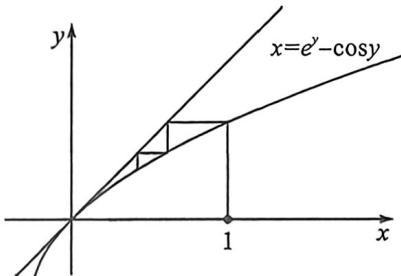
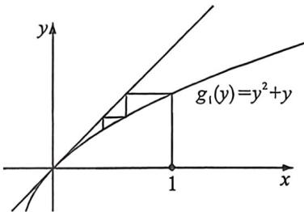

> [!faq]- 例题解析
>
> > [!success]- **【答案】** ACD
>
> > [!note]- **【解析】**
> > $S_{n}$ 为其前 $n$ 项和，则
> > A. $a_{n} > a_{n + 1}$ B. $a_{n} <   a_{n + 1} + a_{n + 1}^{2}$ C. $a_{n}\leqslant \frac{1}{\sqrt{n}}$ D. $S_{n} <   2\sqrt{n}$
> >
> > 解析 设函数 $f(x) = e^{x} - \cos x (x > 0)$ ，所以 $f'(x) = e^{x} + \sin x > 0$ ，所以 $f(x)$ 在 $(0, +\infty)$ 上单调递增。 $f''(x) = e^{x} + \cos x > 0$ ，所以 $f(x)$ 为凹函数，根据反函数知识，比如 $e^{x}$ 和 $\ln x$ ，会出现凹凸反转变化，则 $x = e^{y} - \cos y$ 为单调递增的凸函数，其不动点 $y = e^{y} - \cos y \Rightarrow e^{y} - y - 1 + 1 - \cos y = 0$ ，有唯一解 $y = 0$ ，
> >
> > 
> >
> > 
> >
> > 如左图, 所以 $1=a_{1}>a_{2}>a_{3}>\cdots>a_{n}>0$ , 所以 A 选项正确.
> >
> > 对于B选项，令 $h(x) = e^{x} - \cos x - x - x^{2}, x > 0, h'(x) = e^{x} + \sin x - 1 - 2x$ ，令 $m(x) = h'(x), m'(x) = e^{x} + \cos x - 2$ 令 $n(x) = m'(x)$ ，所以 $n'(x) = e^{x} - \sin x > 0$ ，所以 $n(x)$ ，所以 $m'(x)$ 在 $(0, +\infty)$ 上单调递增，即 $m'(x) > m'(0) = 0$ ，即 $m(x)$ 即 $h'(x)$ 在 $(0, +\infty)$ 上单调递增，即 $h'(x) > h'(0) = 0$ ，即 $h(x)$ 在 $(0, +\infty)$ 上单调递增，即 $h(x) > h(0) = 0$ ，所以 $e^{x} - \cos x - x - x^{2} > 0$ ，所以 $e^{x} - \cos x > x + x^{2}$ . 所以 $a_{n} = e^{a_{n+1}} - \cos a_{n+1} > a_{n+1} + a_{n+1}^{2}(\ast)$ ，所以选项B错误；对于C选项，法一：可利用数学归纳法证明： $a_{n} \leqslant \frac{1}{\sqrt{n}}$ . 因为当 $n = 1$ 时，有 $0 < a_{1} = 1 \leqslant 1 = \frac{1}{\sqrt{1}}$ 成立；假设当 $n = k$ 时，有 $0 < a_{k} \leqslant \frac{1}{\sqrt{k}} (k \in \mathbb{N}^{\bullet})$ ，当 $a_{k+1} > \frac{1}{\sqrt{k+1}}$ ，所以由 (\*) 可知 $a_{k} > a_{k+1} + a_{k+1}^{2} > \frac{1}{\sqrt{k+1}} + \frac{1}{k+1} = \frac{1 + \sqrt{k+1}}{k+1} > \frac{\sqrt{k+1}}{k} > \frac{1}{\sqrt{k}}$ ，与假设 $a_{k} \leqslant \frac{1}{\sqrt{k}}$ 矛盾，因此 $a_{k+1} \leqslant \frac{1}{\sqrt{k+1}}$ . 所以 $a_{n} \leqslant \frac{1}{\sqrt{n}}$ ，所以 C 选项正确.
> >
> > 法二:如右图,作 $x=g_{1}(y)=y^{2}+y$ , $a_{n}>a_{n+1}+a_{n+1}^{2}$ , 有唯一不动点 $(0,0)$ , 且不动点是切点, 故可以裂项相消, 即 $a_{n}>a_{n+1}(1+a_{n+1})$ , $\frac{1}{a_{n}}<\frac{1}{a_{n+1}(1+a_{n+1})}=\frac{1}{a_{n+1}}-\frac{1}{1+a_{n+1}}$ , 所以 $\frac{1}{a_{n+1}}-\frac{1}{a_{n}}>\frac{1}{1+a_{n+1}}>\frac{1}{2}$ , 所以 $\frac{1}{a_{n}}>1+\frac{n-1}{2}$ , 所以 $a_{n}<\frac{2}{n+1}\leqslant\frac{1}{\sqrt{n}}$ , 所以 C 选项正确.
> >
> > 对于D选项，当 $n\geqslant 1$ 时， $a_{n}\leqslant \frac{1}{\sqrt{n}} = \frac{2}{\sqrt{n} + \sqrt{n}} <  \frac{2}{\sqrt{n} + \sqrt{n - 1}} = 2(\sqrt{n} -\sqrt{n - 1})$ ，所以 $S_{n} = \sum_{k = 1}^{n}a_{k} <   2\sum_{k = 1}^{n}(\sqrt{k} -\sqrt{k - 1}) = 2$ $\sqrt{n}$ ，所以选项D正确.
> >
> > 故选 **ACD**.
