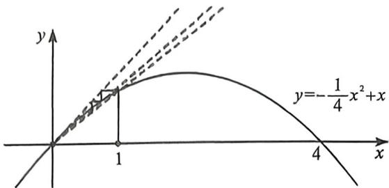

> [!faq]- 例题解析
>
> > [!success]- **【答案】** ACD
>
> > [!note]- **【解析】**
> > $$
> > \frac {3}{1 0 2} <   a _ {1 0 0} <   \frac {4}{1 0 3}
> > $$
> >
> > 
> >
> > 解析 对于 A, 因为 $a_{1}=1, a_{n+1}=a_{n}-\frac{1}{4}a_{n}^{2}(n\in\mathbb{N}^{\circ})$ ，所以 $a_{n+1}-a_{n}=-\frac{1}{4}a_{n}^{2}<0$ ，所以 $\{a_{n}\}$ 为递减数列，如蛛网图也能判断 A 正确；
> >
> > 对于B,法一:因为 $a_{1}=1>0$ ,所以 $a_{n}<1(n\geqslant2)$ ,所以 $a_{n+1}=a_{n}\left(1-\frac{1}{4}a_{n}\right)\in(0,1)$ ,故 $\frac{a_{n+1}}{a_{n}}=1-\frac{1}{4}a_{n}\geqslant\frac{3}{4}>0$ ,即 $\frac{a_{n+1}}{a_{n}}\geqslant\frac{3}{4}$ ,当n=1时等号成立,所以 $a_{n}=a_{1}\cdot\frac{a_{2}}{a_{1}}\cdot\frac{a_{3}}{a_{2}}\cdot\cdots\cdot\frac{a_{n}}{a_{n-1}}\geqslant\left(\frac{3}{4}\right)^{n-1}$ ,当n=1或2时等号成立,B错误;
> >
> > 法二:由于唯一不动点为0,所以 $\frac{3}{4}=\frac{a_{2}}{a_{1}}<\frac{a_{3}}{a_{2}}<\cdots<\frac{a_{n+1}}{a_{n}},a_{n}\geqslant a_{1}\left(\frac{3}{4}\right)^{n-1}=\left(\frac{3}{4}\right)^{n-1}$ ,B错误;
> >
> > 对于C, 因为 $a_{n} - a_{n+1} = \frac{1}{4} a_{n}^{2} > \frac{1}{4} a_{n} a_{n+1}$ , 所以 $\frac{1}{a_{n+1}} - \frac{1}{a_n} > \frac{1}{4}$ , C 正确;
> >
> > 对于 D，由 $\frac{1}{a_{n+1}} - \frac{1}{a_n} > \frac{1}{4}$ 得， $\frac{1}{a_n} = \frac{1}{a_1} + \left(\frac{1}{a_2} - \frac{1}{a_1}\right) + \left(\frac{1}{a_3} - \frac{1}{a_2}\right) + \cdots + \left(\frac{1}{a_n} - \frac{1}{a_{n-1}}\right) > 1 + \frac{1}{4} (n-1) = \frac{n+3}{4} (n \geqslant 2)$ ，故 $a_n < \frac{4}{n+3} (n \geqslant 2)$ ，由 $a_n - a_{n+1} = \frac{1}{4} a_n^2, \frac{a_{n+1}}{a_n} \geqslant \frac{3}{4}$ ，得 $\frac{1}{a_{n+1}} - \frac{1}{a_n} = \frac{1}{4} \times \frac{a_n}{a_{n+1}} \leqslant \frac{1}{4} \times \frac{4}{3} = \frac{1}{3}$ ，当 n=1 时等号成立，所以 $\frac{1}{a_n} = \frac{1}{a_1} + \left(\frac{1}{a_2} - \frac{1}{a_1}\right) + \left(\frac{1}{a_3} - \frac{1}{a_2}\right) + \cdots + \left(\frac{1}{a_n} - \frac{1}{a_{n-1}}\right) \leqslant 1 + \frac{1}{3} (n-1) = \frac{n+2}{3}$ ，故 $a_n \geqslant \frac{3}{n+2}$ ，当 n=1 或 2 时等号成立，
> > 所以 $\frac{3}{102}<a_{100}<\frac{4}{103}$ ，D 正确.
> >
> > 故选 **ACD**.
