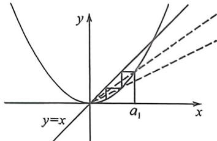
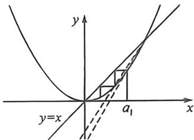

## 考点六_蛛网图与数列放缩的精度

## 一、一级等比放缩精度

当 $f'(x)>0, f''(x)>0$ ，若 $\alpha, \beta$ 为 $f(x)$ 两个不动点，如图所示，我们假设 $f(x)=x^{2}$ ，此函数符合模型，则根据蛛网图，当 $a_{1}\in(0,1)$ 时，则有 $a_{1}>a_{2}>\cdots>a_{n}>0$ ，两个不动点为 $\alpha=0, \beta=1$ ，

如左图, $\frac{a_{2}-0}{a_{1}-0}>\frac{a_{3}-0}{a_{2}-0}>\cdots>\frac{a_{n+1}-0}{a_{n}-0}>f'(0)$ ，如右图, $\frac{a_{2}-1}{a_{1}-1}>\frac{a_{3}-1}{a_{2}-1}>\cdots>\frac{a_{n+1}-1}{a_{n}-1}>1$ ，如此对不动点蛛网图的斜率翻译放缩，称为数列放缩的一级精度。

显然,凸函数也符合斜率递减趋势,参考下面两个例题即可。

![[高中/总复习/二轮/2026版高中《MST新思路思维拓展》二轮复习专题/上册/数列/考点六_蛛网图与数列放缩的精度/questions/Q00093120.md]]
![[高中/总复习/二轮/2026版高中《MST新思路思维拓展》二轮复习专题/上册/数列/考点六_蛛网图与数列放缩的精度/questions/Q00093325.md]]
![[高中/总复习/二轮/2026版高中《MST新思路思维拓展》二轮复习专题/上册/数列/考点六_蛛网图与数列放缩的精度/questions/Q00093122.md]]
![[高中/总复习/二轮/2026版高中《MST新思路思维拓展》二轮复习专题/上册/数列/考点六_蛛网图与数列放缩的精度/questions/Q00093123.md]]
![[高中/总复习/二轮/2026版高中《MST新思路思维拓展》二轮复习专题/上册/数列/考点六_蛛网图与数列放缩的精度/questions/Q00093124.md]]

## 二、二级调和等差精度

若 $\frac{1}{a_n + x_0} = \frac{1}{a_{n+1}} -\frac{1}{a_n} >\frac{1}{a_1 + x_0}$ ，则 $\frac{1}{a_{n+1}} >\frac{1}{a_1} +\frac{n}{a_1 + x_0}$ 此为调和等差数列构造，也是常见的二级精度构造。

![[高中/总复习/二轮/2026版高中《MST新思路思维拓展》二轮复习专题/上册/数列/考点六_蛛网图与数列放缩的精度/questions/Q00093125.md]]
![[高中/总复习/二轮/2026版高中《MST新思路思维拓展》二轮复习专题/上册/数列/考点六_蛛网图与数列放缩的精度/questions/Q00093199.md]]
![[高中/总复习/二轮/2026版高中《MST新思路思维拓展》二轮复习专题/上册/数列/考点六_蛛网图与数列放缩的精度/questions/Q00093350.md]]

## 三、将不可裂项得式子转化为可裂项相消的放缩

第一类: 若 $a_{n+1}-a_{n}=\frac{pa_{n}+q}{a_{n}}$ ，则 $pa_{n}+q=a_{n}(a_{n+1}-a_{n})$ ，利用二阶导和蛛网图判断 $\frac{a_{n+1}}{a_{n}}\in(\alpha,\beta)$ ，从而得到次裂项相消式子： $\alpha(a_{n+1}+a_{n})(a_{n+1}-a_{n})<pa_{n}+q<\beta(a_{n+1}+a_{n})(a_{n+1}-a_{n})$ ;

![[高中/总复习/二轮/2026版高中《MST新思路思维拓展》二轮复习专题/上册/数列/考点六_蛛网图与数列放缩的精度/questions/Q00093200.md]]
![[高中/总复习/二轮/2026版高中《MST新思路思维拓展》二轮复习专题/上册/数列/考点六_蛛网图与数列放缩的精度/questions/Q00093132.md]]
![[高中/总复习/二轮/2026版高中《MST新思路思维拓展》二轮复习专题/上册/数列/考点六_蛛网图与数列放缩的精度/questions/Q00093277.md]]

## 四、累加与借助导数放缩的综合三级精度

遇到 $e^{a_n}, \ln (a_n + 1), \sin (a_n)$ 之类, 通过泰勒展开或者切线进性放缩构造成线性数列, 再进行一些能裂项或者累加的数列, 进行估值, 这里先裂项再累加的精度通常是数列放缩的三级精度。

![[高中/总复习/二轮/2026版高中《MST新思路思维拓展》二轮复习专题/上册/数列/考点六_蛛网图与数列放缩的精度/questions/Q00093351.md]]
![[高中/总复习/二轮/2026版高中《MST新思路思维拓展》二轮复习专题/上册/数列/考点六_蛛网图与数列放缩的精度/questions/Q00093202.md]]
![[高中/总复习/二轮/2026版高中《MST新思路思维拓展》二轮复习专题/上册/数列/考点六_蛛网图与数列放缩的精度/questions/Q00093136.md]]
![[高中/总复习/二轮/2026版高中《MST新思路思维拓展》二轮复习专题/上册/数列/考点六_蛛网图与数列放缩的精度/questions/Q00093352.md]]
