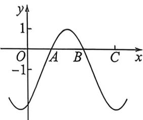
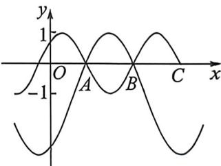

<!-- question-source:start -->
例6 (2026 届广东汕头阶段练习 T14) 若对任何实数 $x \in [0, a]$ , $\sin\left(\omega x + \frac{\pi}{4}\right)\left[2 \sin\left(\frac{4}{3} x - \frac{\pi}{3}\right) - 1\right] \leqslant 0 (\omega > 0)$ 恒成立, 则 $a$ 的最大值为 \_\_\_\_.

图1

图2
<!-- question-source:end -->

![[高中/总复习/二轮/2026版高中《MST新思路思维拓展》二轮复习专题/上册/板块3_三角/考点一_三角函数图像性质/questions/answers/Q00092909A1.md]]
