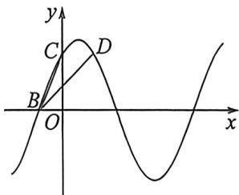
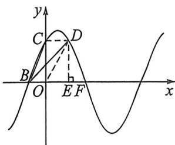

<!-- question-source:start -->
例15 (2026 届广东深圳外国语高三月考(二)T14)已知函数 $f(x)=A\sin(\omega x+\varphi)$ 的部分图象如图所示，O 为坐标原点，B，C 为图象与坐标轴的交点，D 为图象上的点且满足 $\overrightarrow{BO}+\overrightarrow{BC}=\overrightarrow{BD},\overrightarrow{BC}\cdot\overrightarrow{BD}=10$ ， $|BD|=\sqrt{14}$ ，则 $f\left(\frac{\sqrt{2}}{4}\right)=$ \_\_\_\_。

<!-- question-source:end -->

![[高中/总复习/二轮/2026版高中《MST新思路思维拓展》二轮复习专题/上册/板块3_三角/考点一_三角函数图像性质/questions/answers/Q00093156A1.md]]
