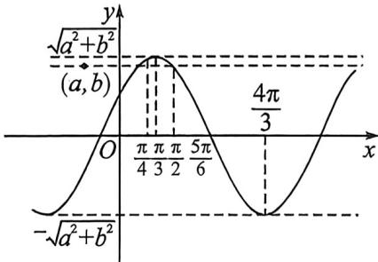

> [!faq]- 例题解析
>
> > [!success]- **【答案】** ACD
>
> > [!note]- **【解析】**
> > 解析 由题意知 $f(x) = \sqrt{a^2 + b^2} \sin (x + \varphi)$ 的最小正周期为 $2\pi, \forall x \in \mathbb{R}, f(x) \leqslant f\left(\frac{\pi}{3}\right)$ ，即当 $x = \frac{\pi}{3}$ 时， $f(x)$ 取得最大值，所以 $x = \frac{\pi}{3}$ 为 $f(x)$ 图象的一条对称轴，
> >
> > 
> >
> > 又 $\left|\frac{\pi}{2} -\frac{\pi}{3}\right| > \left|\frac{\pi}{3} -\frac{\pi}{4}\right|$ ，所以 $f\left(\frac{\pi}{2}\right) <   f\left(\frac{\pi}{4}\right)$ ，故A正确；
> >
> > 因为 $\left|\frac{5\pi}{6} -\frac{\pi}{3}\right| = \frac{\pi}{2}$ ，等于 $f(x)$ 的 $\frac{1}{4}$ 个最小正周期，则 $f\left(\frac{5\pi}{6}\right) = 0$ ，所以 $f(x)$ 的图象不关于直线 $x = \frac{5\pi}{6}$ 对称，故B错误；
> >
> > 因为 $\sqrt{a^2 + b^2} > |b| \geqslant 0$ ，所以点 $(a, b)$ 在两条直线 $y = -\sqrt{a^2 + b^2}$ 与 $y = \sqrt{a^2 + b^2}$ 之间，所以过点 $(a, b)$ 的直线与 $f(x)$ 的图象一定有公共点，故 C 正确；
> >
> > 因为当 $x = \frac{\pi}{3}$ 时， $f(x)$ 取得最大值， $\left|\frac{4\pi}{3} - \frac{\pi}{3}\right| = \pi, \pi$ 为 $f(x)$ 的 $\frac{1}{2}$ 个最小正周期，所以 $f(x)$ 在 $\left[\frac{\pi}{3}, \frac{4\pi}{3}\right]$ 上单调递减，故D正确.
> >
> > 故选 **ACD**.
