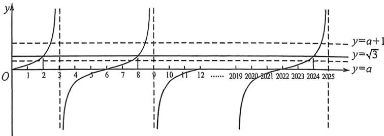

> [!faq]- 例题解析
>
> > [!success]- **【答案】** D
>
> > [!note]- **【解析】**
> > 解析 因为 $\left[\tan \left(\frac{\pi}{6} x\right) - a\right]\left[\tan \left(\frac{\pi}{6} x\right) - a - 1\right] < 0$ ，所以 $a < \tan \left(\frac{\pi}{6} x\right) < a + 1$ ，考虑函数 $y = \tan \left(\frac{\pi}{6} x\right)$ 在(0,2025)的图像，以6为周期，先考虑一条直线 $y = t (t \in \mathbb{R})$ 与函数的整点交点，注意到在一个周期(0,6]内，可能存在的整点有1,2,4,5,6，可得 $t \in \left\{-\sqrt{3}, -\frac{\sqrt{3}}{3}, 0, \frac{\sqrt{3}}{3}, \sqrt{3}\right\}$ ，以下分情况讨论：
> > - **①**：当 $t=\sqrt{3}$ 时， $x=2+6k, k=0,1,2,\cdots,337$ ，有 338 个整点；
> > - **②**：当 $t=\frac{\sqrt{3}}{3}$ 时， $x=1+6k, k=0,1,2,\cdots,337$ ，有 338 个整点；
> > - **③**：当 t=0 时， $x=6+6k, k=0,1,2,\cdots,336$ ，有 337 个整点；
> > - **④**：当 $t=-\frac{\sqrt{3}}{3}$ 时， $x=5+6k, k=0,1,2,\cdots,336$ ，有 337 个整点；
> > - **⑤**：当 $t=-\sqrt{3}$ 时， $x=4+6k, k=0,1,2,\cdots,336$ ，有 337 个整点，
> >
> > 再考虑直线 $y = a$ 与 $y = a + 1$ 所包围的区域（不含边界），
> >
> > 
> >
> > 注意到区间 $(a, a + 1)$ 的长度为1，所以可能 $0, -\frac{\sqrt{3}}{3} \in (a, a + 1)$ ，就有 $337 + 337 = 674$ 个整点，故 $C$ 可能；
> >
> > 因为 $\frac{\sqrt{3}}{3}$ 与 $\sqrt{3}$ 的距离为 $\frac{2\sqrt{3}}{3} > 1$ ，所以只可能是 $\frac{\sqrt{3}}{3}$ 或 $\sqrt{3}$ 中的一个 $\in (a, a + 1)$ ，就有 338 个整点，故 B 可能；
> >
> > 而当 $a > \sqrt{3}$ 时， $\left\{-\sqrt{3}, - \frac{\sqrt{3}}{3},0,\frac{\sqrt{3}}{3},\sqrt{3}\right\}$ 中没有元素 $\in (a,a + 1)$ ，就有0个整点，故A可能；
> >
> > 注意到 $1012 = 338 + 337 + 337$ ，但 $\frac{\sqrt{3}}{3}$ 与 $-\frac{\sqrt{3}}{3}$ 的距离为 $\frac{2\sqrt{3}}{3} > 1$ ，故D不可能.
> >
> > 故选 **D**.
