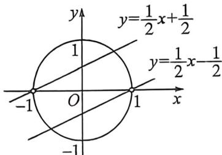

> [!faq]- 例题解析
>
> > [!success]- **【答案】** D
>
> > [!note]- **【解析】**
> > 解析 + A, 因为 $x \in \left(-\frac{\pi}{2}, \frac{\pi}{2}\right)$ , 所以 $\sin x \in (-1, 1), \cos x \in (0, 1]$ , 所以 $f(\sin x) = \cos x = \sqrt{1 - \sin^2 x}$ , 令 $t = \sin x \in (-1, 1)$ , 则 $f(t) = \sqrt{1 - t^2}, t \in (-1, 1)$ , 即 $f(x) = \sqrt{1 - x^2}, x \in (-1, 1)$ , 所以 $f(-x) = \sqrt{1 - x^2} = f(x)$ , 所以 $f(x)$ 为偶函数, 错误;
> >
> > 对于 B, 由 A 知函数 $f(x)$ 的定义域为 $(-1,1)$ , 值域为 $(0,1]$ , 错误;
> >
> > 对于 C, 由 $\left|y\right|=f(x)$ , 得 $\left|y\right|=\sqrt{1-x^{2}}$ , 即 $x^{2}+y^{2}=1$ 表示单位圆不含点 $(-1,0)$ 和 $(1,0)$ , 由题意, 直线 $l: y=\frac{1}{2}x+b$ 与单位圆有两个交点, 所以圆心到直线 l 的距离 $d=\frac{\left|b\right|}{\sqrt{1+\left(\frac{1}{2}\right)^{2}}}=\frac{2\left|b\right|}{\sqrt{5}}<1$ , 解得 $b\in\left(-\frac{\sqrt{5}}{2},\frac{\sqrt{5}}{2}\right)$ ,
> >
> > 当直线 $l: y = \frac{1}{2} x + b$ 过点 $(-1,0)$ 时，可得 $b = \frac{1}{2}$ ，当直线 $l: y = \frac{1}{2} x + b$ 过点 $(1,0)$ 时，可得 $b = -\frac{1}{2}$ ，所以 $b \in \left(-\frac{\sqrt{5}}{2}, -\frac{1}{2}\right) \cup \left(-\frac{1}{2}, \frac{1}{2}\right) \cup \left(\frac{1}{2}, \frac{\sqrt{5}}{2}\right)$ ，错误；
> >
> > 
> >
> > 对于 D, 由弦长公式可得 $\left|MN\right|=2\sqrt{1-d^{2}}$ , 又 $0 \leqslant d < 1$ , 所以当 d=0, 即直线 l 过原点时, $\left|MN\right|$ 取最大值, 为 2, 正确.
> >
> > 故选 **D**.
