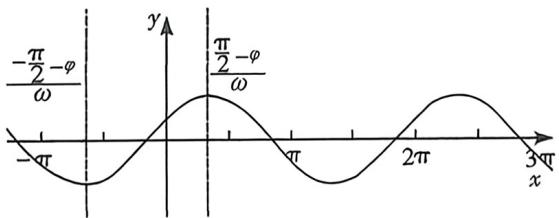
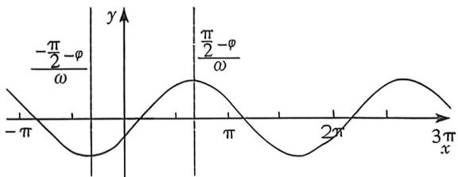
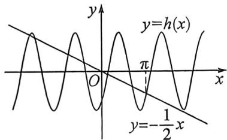
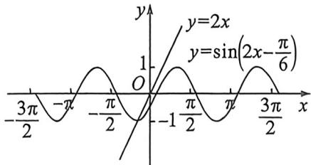

## 考点一_三角函数图像性质

## 一、图像平移与求单调区间值域问题

![[高中/总复习/二轮/2026版高中《MST新思路思维拓展》二轮复习专题/上册/板块3_三角/考点一_三角函数图像性质/questions/Q00092904.md]]
![[高中/总复习/二轮/2026版高中《MST新思路思维拓展》二轮复习专题/上册/板块3_三角/考点一_三角函数图像性质/questions/Q00092905.md]]
![[高中/总复习/二轮/2026版高中《MST新思路思维拓展》二轮复习专题/上册/板块3_三角/考点一_三角函数图像性质/questions/Q00092906.md]]
![[高中/总复习/二轮/2026版高中《MST新思路思维拓展》二轮复习专题/上册/板块3_三角/考点一_三角函数图像性质/questions/Q00093155.md]]
![[高中/总复习/二轮/2026版高中《MST新思路思维拓展》二轮复习专题/上册/板块3_三角/考点一_三角函数图像性质/questions/Q00092908.md]]
![[高中/总复习/二轮/2026版高中《MST新思路思维拓展》二轮复习专题/上册/板块3_三角/考点一_三角函数图像性质/questions/Q00092909.md]]

## 二、 $\omega$ 范围问题之定位卡根

$f(x) = A\sin (\omega x + \varphi)$ 当中，都会给一个条件，就是 $|\varphi| < \frac{\pi}{2}$ ，所以，当 $0 < \varphi < \frac{\pi}{2}$ 时，图像如左下，当 $-\frac{\pi}{2} < \varphi < 0$ 时，图像如右下：

我们通过图形可以知道,无论 $\omega$ 为任意正数,则正弦函数的靠近零点的第一个递增区间最小值 $\frac{-\frac{\pi}{2}-\varphi}{\omega}$ 和最大值 $\frac{\frac{\pi}{2}-\varphi}{\omega}$ 均在第三和第一象限,卡根就从这个周期的五点开始操作,以此类推,我们称之为定位卡

根法.

如果卡根区间没有过零点,那么在卡根区间进行周期卡根,就看最多或者最少能放进去几个周期,当然,前提就是要先卡形式,即 $\omega$ 关于 n 的表达式(n 为正整数).

定理:轴心距 $\frac{2n-1}{4}T(n\in N^{\circ})$ ，也可以转化为 $\frac{(2n-1)\pi}{2\omega}(n\in N^{\circ})$

例 (2025·天津) $f(x)=\sin(\omega x+\varphi)(\omega>0,-\pi<\varphi<\pi)$ ，在 $\left[-\frac{5\pi}{12},\frac{\pi}{12}\right]$ 上单调递增，且 $x=\frac{\pi}{12}$ 为它的一条对称轴， $\left(\frac{\pi}{3},0\right)$ 是它的一个对称中心，当 $x\in\left[0,\frac{\pi}{2}\right]$ 时， $f(x)$ 的最小值为（）
A. $-\frac{\sqrt{3}}{2}$ B. $-\frac{1}{2}$ C.1
D.0

解析：因为 $f(x)$ 在 $\left[-\frac{5\pi}{12}, \frac{\pi}{12}\right]$ 上单调递增，且 $x = \frac{\pi}{12}$ 为它的一条对称轴，可得 $f\left(\frac{\pi}{12}\right) = 1$ ，即 $\frac{\pi}{12}\omega + \varphi = 2k\pi + \frac{\pi}{2}, k \in Z, ①$ ，因为 $f(x)$ 的图象关于 $\left(\frac{\pi}{3}, 0\right)$ 对称，所以 $\frac{\pi}{3}\omega + \varphi = m\pi, m \in Z, ②$ 且 $\frac{\pi}{3} - \frac{\pi}{12} = \frac{2n+1}{4}T = \frac{2n+1}{4} \times \frac{2\pi}{\omega}, n \in Z$ ，解得 $\omega = 4n+2, n \in Z$ ，因为在 $\left[-\frac{5\pi}{12}, \frac{\pi}{12}\right]$ 上单调递增，所以 $\frac{\pi}{12} - \left(-\frac{5\pi}{12}\right) \leqslant \frac{T}{2}$ ，解得 $0 < \omega \leqslant 2$ ，所以 $\omega = 2$ ，根据①②，可得 $\left\{ \begin{array}{l} \varphi = 2k\pi + \frac{\pi}{3} \\ \varphi = m\pi - \frac{2\pi}{3} \end{array} \right.$ ，因为 $-\pi < \varphi < \pi$ ，所以 $\varphi = \frac{\pi}{3}$ ，法二（卡根） $f(x) = \sin (\omega x + \varphi)(\omega > 0)$ 在 $\left[-\frac{5\pi}{12}, \frac{\pi}{12}\right]$ 上单调递增，所以 $\frac{T}{2} \geqslant \frac{\pi}{2}, \omega \leqslant 2$ ，由于 $\frac{\pi}{3} - \frac{\pi}{12} = \frac{\pi}{4} = \frac{(2n-1)T}{4}$ ，根据分析只能是 $n = 1$ ，所以 $\omega = 2$ ，所以 $\frac{\frac{\pi}{2} - \varphi}{2} = \frac{\pi}{12}$ ，所以 $\varphi = \frac{\pi}{3}$ ，故 $f(x) = \sin (2x + \frac{\pi}{3})$ ，当 $x \in [0, \frac{\pi}{2}]$ 时， $2x + \frac{\pi}{3} \in [\frac{\pi}{3}, \frac{4\pi}{3}]$ ，可得 $f(x)$ 的最小值为 $f\left(\frac{\pi}{2}\right) = \sin \frac{4\pi}{3} = -\frac{\sqrt{3}}{2}$ . 故选：A.

![[高中/总复习/二轮/2026版高中《MST新思路思维拓展》二轮复习专题/上册/板块3_三角/考点一_三角函数图像性质/questions/Q00093230.md]]
![[高中/总复习/二轮/2026版高中《MST新思路思维拓展》二轮复习专题/上册/板块3_三角/考点一_三角函数图像性质/questions/Q00092912.md]]
![[高中/总复习/二轮/2026版高中《MST新思路思维拓展》二轮复习专题/上册/板块3_三角/考点一_三角函数图像性质/questions/Q00092913.md]]
![[高中/总复习/二轮/2026版高中《MST新思路思维拓展》二轮复习专题/上册/板块3_三角/考点一_三角函数图像性质/questions/Q00092914.md]]

## 三、三角函数切线与直线交点数形几何问题

![[高中/总复习/二轮/2026版高中《MST新思路思维拓展》二轮复习专题/上册/板块3_三角/考点一_三角函数图像性质/questions/Q00092915.md]]

## 例B (2026届湖北楚天协作期高三10月月考T10·多选)已知将函数 $f(x) = 2\sin^2 x + 2\sqrt{3}\sin x\cos x - 1$

$$
\frac {5 \pi}{6}
$$

$$
g (x)
$$

A. $f(x)$ 的最小正周期为 $\pi$

B. $g(x) = 2\cos 2x$

C. $g(x)$ 的对称轴为 $x=\frac{\pi}{2}+\frac{k\pi}{2}, k\in Z$

D. 若函数 $h(x) = g(x) + g\left(x + \frac{\pi}{4}\right)$ , 则 $y = 2h(x) + x$ 在 $(-\infty, \pi)$ 上有 6 个零点

解析 $f(x) = 2\sin^2 x + 2\sqrt{3}\sin x\cos x - 1 = \sqrt{3}\sin 2x - \cos 2x = 2\sin \left(2x - \frac{\pi}{6}\right)$ ;

对 A: 依题意, $T=\frac{2\pi}{2}=\pi$ , 故 A 正确;

对 B: $g(x)=2\sin\left(2x+2\times\frac{5\pi}{6}-\frac{\pi}{6}\right)=2\sin\left(2x+\frac{3\pi}{2}\right)=-2\cos2x$ ，故 B 错误；

对 C: 由 $g(x) = -2\cos2x$ ，令 $2x = \pi + k\pi, k \in Z$ ，解得 $x = \frac{\pi}{2} + \frac{k\pi}{2}, k \in Z$ ，故 $g(x)$ 的对称轴为 $x = \frac{\pi}{2} + \frac{k\pi}{2}, k \in Z$ ，故 C 正确；

$$
\mathrm{D}: h (x) = g (x) + g \left(x + \frac {\pi}{4}\right) = - 2 \cos 2 x - 2 \cos \left(2 x + \frac {\pi}{2}\right), 2 \sin 2 x - 2 \cos 2 x = 2 \sqrt {2} \sin \left(2 x - \frac {\pi}{4}\right)
$$

令 $y = 2h(x) + x = 0$ ，则 $h(x) = -\frac{x}{2}$ ，在直角坐标系中分别作出 $y = h(x), y = -\frac{1}{2} x$ 的图象如图所示，

观察可知,它们在 $(-∞,π)$ 上有6个交点,即 $y=2h(x)+x$ 在 $(-∞,π)$ 上有6个零点,故D正确.故选:ACD.

例(2026届河北保定高三10月月考T10·多选)已知函数 $f(x)=a\sin2x+b\cos2x(a>0,b\in\mathbb{R})$ 在 $x=\frac{\pi}{3}$ 处取得极值,则

A. $b = -\sqrt{3} a$

B. $f\left(\frac{4\pi}{3}\right) = -2b$

C. $f(x)$ 的图象关于点 $\left(\frac{\pi}{12},0\right)$ 对称 D. 关于 $x$ 的方程 $f(x) = -4bx$ 有且只有一个解

$$
f (x) = a \sin 2 x + b \cos 2 x (a > 0, b \in \mathbf {R}), f ^ {\prime} (x) = 2 a \cos 2 x - 2 b \sin 2 x,
$$

对于A，依题意， $f^{\prime}\left(\frac{\pi}{3}\right) = 2a\cos \frac{2\pi}{3} -2b\sin \frac{2\pi}{3} = 0$ ，所以 $a = -\sqrt{3} b,A$ 选项错误；

对于 B, 由 A 可知, $f(x) = -\sqrt{3}b\sin2x + b\cos2x = -2b\sin\left(2x - \frac{\pi}{6}\right)$ , 所以 $f\left(\frac{4\pi}{3}\right) = -2b\sin\left(2 \times \frac{4\pi}{3} - \frac{\pi}{6}\right) = -2b$ , B 选项正确;

对于 C，由 $f\left(\frac{\pi}{12}\right)=0$ ，所以 $f(x)$ 的图象关于点 $\left(\frac{\pi}{12},0\right)$ 对称，C 选项正确；

对于 D, 因 $f(x) = -4bx$ 有且只有一个解等价于 $\sin\left(2x - \frac{\pi}{6}\right) = 2x$ 有且只有一个解, 由图象分析可知, 曲线 $y = \sin\left(2x - \frac{\pi}{6}\right)$ 与直线 $y = 2x$ 在 $\left(-\frac{\pi}{2}, 0\right)$ 恰有一解, 又由 $y = \sin\left(2x - \frac{\pi}{6}\right)$ 求导得 $y' = 2\cos\left(2x - \frac{\pi}{6}\right)$ , 因 $y' |_{x=12} = 2\cos\left(2 \cdot \frac{\pi}{12} - \frac{\pi}{6}\right) = 2$ , 即曲线 $y = \sin\left(2x - \frac{\pi}{6}\right)$ 在 $x = \frac{\pi}{12}$ 处的切线的斜率为 2 与直线 y = 2x 斜率相等, 故方程 $f(x) = -4bx$ 有且只有一解, 故 D 正确. 故选: BCD.

![[高中/总复习/二轮/2026版高中《MST新思路思维拓展》二轮复习专题/上册/板块3_三角/考点一_三角函数图像性质/questions/Q00093156.md]]
![[高中/总复习/二轮/2026版高中《MST新思路思维拓展》二轮复习专题/上册/板块3_三角/考点一_三角函数图像性质/questions/Q00092918.md]]
