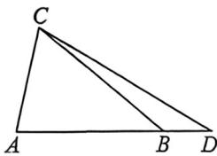

<!-- question-source:start -->
例11 (2026届四川内江第一次月考T11·多选)在 $\triangle ABC$ 中,角 $A,B,C$ 所对的边长分别为 $a,b,c$ ,且满足 $\sin B+\sin C=2\sin A\cos B$ .点 $D$ 在线段 $AB$ 的延长线上,则下列选项中正确的是()

A. $a^2 - b^2 = bc$

B. 若 $2c = a + b$ ，则 $\cos \angle ABC = \frac{4}{5}$

C. $A = 2B$

D. 若 $|AB|=3,|BD|=1$ , 当点 C 运动时， $|CD|-|CA|$ 为定值
<!-- question-source:end -->

![[高中/总复习/二轮/2026版高中《MST新思路思维拓展》二轮复习专题/上册/板块3_三角/考点一_三角恒等式/questions/answers/Q00093300A1.md]]
