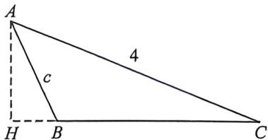

> [!faq]- 例题解析
>
> > [!success]- **【答案】** $\frac{14\sqrt{5}}{9}$
>
> > [!note]- **【解析】**
> > 解析 因为 $\cos2\alpha=1-2\sin^{2}\alpha$ ，所以 $\cos2C-\cos2B=(1-2\sin^{2}C)-(1-2\sin^{2}B)=2(\sin^{2}B-\sin^{2}C)=2\sin C\sin A$ ，
> > 所以 $\sin^{2}B-\sin^{2}C=\sin C\sin A$ ，因为 $\frac{a}{\sin A}=\frac{b}{\sin B}=\frac{c}{\sin C}=2R$ ，所以 $\sin A=\frac{a}{2R},\sin B=\frac{b}{2R},\sin C=\frac{c}{2R}$
> >
> > 所以 $\left(\frac{b}{2R}\right)^2 -\left(\frac{c}{2R}\right)^2 = \frac{c}{2R}\cdot \frac{a}{2R}$ 所以 $b^{2} - c^{2} = ac,B = 2C,$
> >
> > 法一: 因为 b=4, 所以 $c^{2}+ac=16$ ①, 因为 $\cos C=\frac{a^{2}+b^{2}-c^{2}}{2ab}=\frac{a^{2}+(c^{2}+ac)-c^{2}}{2ab}=\frac{a^{2}+ac}{2ab}=\frac{a+c}{2b}=\frac{2}{3}$ , 所以 $a+c=\frac{16}{3}$ ②, 联立①②得: $c=3, a=\frac{7}{3}$ ，因为 $0<C<180^{\circ}, \cos C=\frac{2}{3}$ ，所以 $\sin C=\sqrt{1-\cos^{2}C}=\sqrt{1-\left(\frac{2}{3}\right)^{2}}=\frac{\sqrt{5}}{3}$ ，所以 $S_{\triangle ABC}=\frac{1}{2}ab\sin C=\frac{1}{2}\times\frac{7}{3}\times4\times\frac{\sqrt{5}}{3}=\frac{14\sqrt{5}}{9}$ ,
> >
> > 法二:如图, $B=2C,\cos C=\frac{2}{3}\Rightarrow\cos B=2\cos^{2}C-1=-\frac{1}{9}$ ，所以 $a=b\cos C+c\cos B=\frac{8}{3}-\frac{1}{9}c$ ，高 $h=4\sin C=\frac{4\sqrt{5}}{3}=$ $c\sin B \Rightarrow c = 3, S_{\triangle ABC} = \frac{1}{2} ah = \frac{1}{2} \times \frac{7}{3} \times \frac{4\sqrt{5}}{3} = \frac{14\sqrt{5}}{9}$ ，故答案为： $\frac{14\sqrt{5}}{9}$ .
> >
> > 
