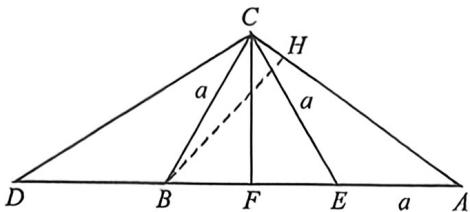

> [!faq]- 例题解析
>
> > [!success]- **【答案】** ABD
>
> > [!note]- **【解析】**
> > 解析 由于 $b - a^2 = ac$ ，故 $B = 2A, B$ 正确；
> >
> > 对于 A, 法一: $h = c \sin A$ , 由 h = c - a, 得 $c \sin A = c - a$ , 由正弦定理得 $\sin C \sin A = \sin C - \sin A$ , 而 $\sin C \sin A > 0$ , 因此 $\frac{1}{\sin A} - \frac{1}{\sin C} = 1$ ,
> >
> > 法二:如图, $h=|BH|=c-a=|BE|=2a\cos B$ ,故 $\frac{1}{\sin A}-\frac{1}{\sin C}=\frac{AB}{BH}-\frac{BC}{BH}=\frac{BE}{BH}=1$ ,A正确;
> >
> > 
> >
> > 对于 C, 法一: 若 $a + c = 2h$ , 则 c = 3a, 由正弦定理得 $\sin C = 3\sin A$ , 由选项 B 知, $3\sin A = \sin 3A = \sin 2A \cos A + \cos 2A \sin A = (4 \cos^2 A - 1)\sin A$ , 解得 $\cos^2 A = 1$ , 即 $\sin A = 0$ , 矛盾;
> >
> > 法二:如图, $a+c=|AD|=2b\cos A$ ,若 $a+c=2h$ ,则 $h=b\cos A=|AF|$ ,显然 $|AF|=a+\frac{|BE|}{2}=a+\frac{h}{2}>|BF|+\frac{h}{2}=h$ ,矛盾,C错误;
> >
> > 对于 D, 由选项 A 知, $\frac{1}{\sin A}-\frac{1}{\sin C}=\frac{1}{\sin A}-\frac{1}{\sin 3A}=1$ , 而 $\sin 3A=\sin A(4\cos^{2}A-1)$ , 则 $(3-4\sin^{2}A)(1-\sin A)=1$ , 整理得 $(2\sin A-1)(2\sin^{2}A-\sin A-2)=0$ , 而 $2\sin^{2}A<\sin A+2$ , 因此 $\sin A=\frac{1}{2}$ , 又 $0<2A<\pi$ , 则 $A=\frac{\pi}{6}, B=\frac{\pi}{3}, \tan B=\sqrt{3}=2\cos A$ , D 正确.
> >
> > 故选 **ABD**.
