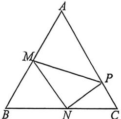

> [!faq]- 例题解析
>
> > [!success]- **【答案】** $\frac{7\sqrt{3}}{3}$
>
> > [!note]- **【解析】**
> > 解析 法一： $\sin^{2}A+\sin^{2}B+\sin^{2}C=2\sqrt{3}\sin A\sin B\sin C$ ，所以由正弦定理可得： $a^{2}+b^{2}+c^{2}=2\sqrt{3}bc\sin A$
> >
> > 又因为 $a^2 = b^2 + c^2 - 2bc\cos A$ ，代入上式得： $2b^2 + 2c^2 - 2bc\cos A = 2\sqrt{3}bc\sin A$ ，整理可得： $\frac{b}{c} + \frac{c}{b} = \cos A + \sqrt{3}\sin A = 2\sin (A + \frac{\pi}{6}) \geqslant 2\sqrt{\frac{b}{c} \times \frac{c}{b}} = 2$ ，所以 $2\sin (A + \frac{\pi}{6}) \geqslant 2$ ，当且仅当 $b = c$ 时，等号成立，
> >
> > 由于 $2\sin \left(A + \frac{\pi}{6}\right) \leqslant 2$ ，所以 $2\sin \left(A + \frac{\pi}{6}\right) = 2$ ，因为 $A \in (0, \pi)$ ，所以 $A = \frac{\pi}{3}$ ，又此时 $b = c$ ，所以 $\triangle ABC$ 为等边三角
> >
> >
> > 形，则 $A = \frac{\pi}{3}$
> >
> > 法二：因为 $\sin^2 A + \sin^2 B + \sin^2 C = 2\sqrt{3}\sin A\sin B\sin C = 2 + 2\cos A\cos B\cos C$ ，由于轮换对称，且当 $A = B = C$ 时， $2\sqrt{3}\cdot$ $\frac{\sqrt{3}}{2}\cdot \frac{\sqrt{3}}{2}\cdot \frac{\sqrt{3}}{2} = 2 + 2\cdot \frac{1}{2}\cdot \frac{1}{2}\cdot \frac{1}{2}$ 恰好成立， $\sin^2 A + \sin^2 B + \sin^2 C = 2\sqrt{3}\sin A\sin B\sin C\geqslant 3\sqrt[3]{\sin A\sin B\sin C}$ ，故 $\sin A\sin B\sin C\geqslant \frac{3\sqrt{3}}{8}$ ，利用琴声不等式， $\sin A\sin B\sin C\leqslant \left(\frac{\sin A + \sin B + \sin C}{3}\right)^3\leqslant \left(\sin \frac{A + B + C}{3}\right)^3 = \frac{3\sqrt{3}}{8}$ ，当且仅当 $A$ $= B = C$ 时取等，
> >
> > 如图，在 $\triangle MNP$ 中，由余弦定理得： $NP = \sqrt{(\sqrt{3})^2 + 2^2 - 2\times\sqrt{3}\times 2\cos 30^\circ} = 1$ ，所以 $MN^2 +NP^2 = MP^2$ ，所以 $\angle MNP$ $= 90^{\circ}$ ，从而 $\angle MPN = 60^{\circ}$ ，设 $\angle APM = \alpha$ ，则 $\angle AMP = 120^{\circ} - \alpha ,\angle CPN = 120^{\circ} - \alpha ,\angle PNC = \alpha ,$
> >
> > 
> >
> > 在 $\triangle CPN$ 中,由正弦定理得 $\frac{PC}{\sin\alpha}=\frac{1}{\sin60^{\circ}}$ ,则 $PC=\frac{2}{\sqrt{3}}\sin\alpha$ ,在 $\triangle AMP$ 中,由正弦定理得 $\frac{AP}{\sin(120^{\circ}-\alpha)}=\frac{2}{\sin60^{\circ}}$ ,则 $AP=\frac{4}{\sqrt{3}}\sin(120^{\circ}-\alpha)$ ,所以 $AC=AP+PC=\frac{4}{\sqrt{3}}\sin(120^{\circ}-\alpha)+\frac{2}{\sqrt{3}}\sin\alpha=\frac{2\sqrt{7}}{\sqrt{3}}\sin(\alpha+\theta)$ ,其中 $\tan\theta=\frac{\sqrt{3}}{2}$ ,所以 $AC$ 的最大值为 $\frac{2\sqrt{7}}{\sqrt{3}}$ ,当 $\alpha=90^{\circ}-\theta$ 时取得最大值,所以 $(S_{\triangle ABC})_{\max}=\frac{\sqrt{3}}{4}\cdot AC^{2}=\frac{\sqrt{3}}{4}\times\frac{4\times7}{3}=\frac{7\sqrt{3}}{3}$ .故答案为: $\frac{7\sqrt{3}}{3}$ .
