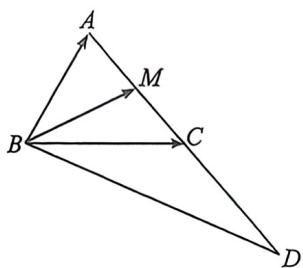
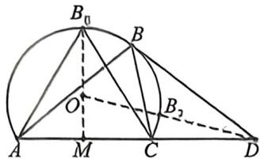
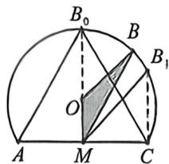

> [!faq]- 例题解析
>
> > [!success]- **【答案】** ACD
>
> > [!note]- **【解析】**
> > 解析 对于 A, 已知 $\frac{\cos C}{\cos B} = \frac{2a - c}{2} = \frac{2a - c}{b}$ ，由射影定理得: $b \cos C + c \cos B = 2a \cos B = a$ ，故 $\cos B = \frac{1}{2}$ ,
> >
> > 而 $B \in (0, \pi)$ , 所以 $B = \frac{\pi}{3}$ , 选项 A 正确;
> >
> > 对于 BCD, 法一(强哥硬解): 在 $\triangle ABC$ 中, 由余弦定理 $\cos B = \frac{a^2 + c^2 - b^2}{2ac}$ , 得 $a^2 + c^2 - 4 = ac$ , 所以 $ac = a^2 + c^2 - 4 \geqslant 2ac - 4$ , 所以 $ac \leqslant 4$ , 当且仅当 $a = c$ 时取等号, 由于 $S_{\triangle ABD} = 2S_{\triangle ABC} = 2 \times \frac{1}{2} ac \sin B = \frac{\sqrt{3}}{2} ac \leqslant 2\sqrt{3}$ , 所以 $\triangle ABD$ 的面积的最大值为 $2\sqrt{3}$ , 故选项 B 错误;
> >
> > 
> >
> > 对于 C, 在 $\triangle ABC$ 中, 由正弦定理得 $\frac{a}{\sin A} = \frac{c}{\sin C} = \frac{b}{\sin B} = \frac{2}{\frac{\sqrt{3}}{2}}, a = \frac{4\sqrt{3}}{3}\sin A, c = \frac{4\sqrt{3}}{3}\sin C$ , 由 AC 的中点为 M, 有 $\overrightarrow{BM} = \frac{1}{2} (\overrightarrow{BA} + \overrightarrow{BC}), |\overrightarrow{BM}| = \frac{1}{2} |\overrightarrow{BA} + \overrightarrow{BC}| = \frac{1}{2}\sqrt{a^2 + c^2 + ac} = \frac{1}{2}\sqrt{4 + 2ac} = \frac{1}{2}\sqrt{4 + \frac{32}{3}\sin A\sin C}$ $= \frac{1}{2}\sqrt{4 + \frac{32}{3}\sin A\sin\left(\frac{\pi}{3} + A\right)} = \frac{1}{2}\sqrt{4 + \frac{16\sqrt{3}}{3}\sin A\cos A + \frac{16}{3}\sin^2 A}$ $= \frac{1}{2}\sqrt{4 + \frac{8\sqrt{3}}{3}\sin 2A + \frac{8}{3}(1 - \cos 2A)} = \frac{1}{2}\sqrt{\frac{20}{3} + \frac{8}{3}(\sqrt{3}\sin 2A - \cos 2A)} = \frac{1}{2}\sqrt{\frac{20}{3} + \frac{16}{3}\sin\left(2A - \frac{\pi}{6}\right)}$ ,
> >
> > $\triangle ABC$ 为锐角三角形，则 $\left\{ \begin{array}{l}0 < A < \frac{\pi}{2}\\ 0 < \frac{2\pi}{3} -A < \frac{\pi}{2} \end{array} \right.$ ，得 $\frac{\pi}{6} < A < \frac{\pi}{2}$ ，当 $A\in \left(\frac{\pi}{6},\frac{\pi}{2}\right)$ ，有 $2A - \frac{\pi}{6}\in \left(\frac{\pi}{6},\frac{5\pi}{6}\right)$ ，所以sin $(2A - \frac{\pi}{6})\in \left(\frac{1}{2},1\right]$ ，有 $\frac{20}{3} +\frac{16}{3}\sin \left(2A - \frac{\pi}{6}\right)\in \left(\frac{28}{3},12\right]$ ，故 $|\overrightarrow{BM} |\in \left(\frac{\sqrt{21}}{3},\sqrt{3}\right]$ ，选项C正确；
> >
> > 对于 D, 设 $A=\theta$ , 所以 $a=\frac{4\sqrt{3}}{3}\sin\theta$ , 在 $\triangle BCD$ 中由余弦定理,
> >
> > $$
> > B D ^ {2} = a ^ {2} + 4 - 2 \times 2 \times a \cos \left(\theta + \frac {\pi}{3}\right) = \frac {1 6}{3} \sin^ {2} \theta + 4 - \frac {1 6 \sqrt {3}}{3} \sin \theta \cos \left(\theta + \frac {\pi}{3}\right)
> > $$
> >
> > $$
> > = \frac {4 0}{3} \sin^ {2} \theta + 4 - \frac {8 \sqrt {3}}{3} \sin \theta \cos \theta = \frac {2 0}{3} (1 - \cos 2 \theta) + 4 - \frac {4 \sqrt {3}}{3} \sin 2 \theta = \frac {3 2}{3} - \frac {4}{3} (\sqrt {3} \sin 2 \theta + 5 \cos 2 \theta) = \frac {3 2}{3} - \frac {8 \sqrt {7}}{3} \sin (2 \theta + \varphi),
> > $$
> >
> >
> > $\frac{2\sqrt{21}-2\sqrt{3}}{3}$ ，故D选项正确.
> >
> > 
> >
> > 
> >
> > 法二(辅助圆构造):如图,若 $b=|AC|=2,\angle B=\frac{\pi}{3}$ ,故B在以AC为定弦对定角的圆(优弧)上,我们以 $M(0,0)$ 为中心建系,则半径 $r=\frac{b}{2\sin B}=\frac{2\sqrt{3}}{3}$ ,圆心 $O\left(0,\frac{\sqrt{3}}{3}\right),S_{\triangle ABD}=\frac{1}{2}|AD|y_{B}\leqslant2(|OM|+r)=2\sqrt{3}$ ,当B位于此圆弧的最高点 $B_{0}$ 时取得等号,B正确; $D(3,0),|OD|=\sqrt{|OM|^{2}+|MC|^{2}}=\frac{2\sqrt{21}}{3}$ ,由几何性质得 $|OD|-r\leqslant|BD|\leqslant|OD|+r$ ,故 $|BD|\geqslant|OD|-r=\frac{2\sqrt{21}-2\sqrt{3}}{3}$ ,当B位于 $B_{2}$ 位置时取等,故D正确;如右图所示,过C作 $CB_{1}\perp AC$ 交圆弧于 $B_{1}$ ,此时圆弧位于方程 $x^{2}+\left(y-\frac{\sqrt{3}}{3}\right)^{2}=\frac{4}{3}$ ,且 $-1\leqslant x\leqslant1$ ,此时 $\frac{2\sqrt{3}}{3}<y\leqslant\sqrt{3}$ ,根据射影定理,在 $\Delta OMB$ 中, $|BM|=|OM|\cos\angle OMB+|OB|\cos\angle OBM=\frac{\sqrt{3}}{3}\cos\angle OMB+\frac{2\sqrt{3}}{3}\cos\angle OBM$ ,且从 $B_{1}$ 到 $B_{0}$ 变化中, $\cos\angle OMB$ 和 $\cos\angle OBM$ 同时变大,所以 $|B_{1}M|<|BM|\leqslant|B_{0}M|$ ,即 $|BM|\in\left(\frac{\sqrt{21}}{3},\sqrt{3}\right]$ ,C正确;故选:ACD.
> >
> > 注意 辅助圆弧作为定边定角模型中非常常用plus版本解法，值得研究。
