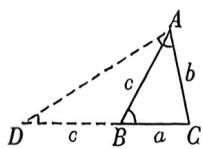
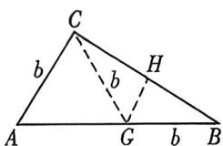
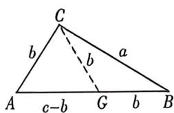
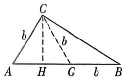

> [!faq]- 例题解析
>
> > [!success]- **【答案】** D
>
> > [!note]- **【解析】**
> > 解析 $2b = 3c$ ，得 $\frac{b}{c} = \frac{3}{2} = \frac{\sin B}{\sin C}$ ，令 $b = 3t, c = 2t$ ，因为 $B = 2C$ ，所以 $b^2 = c(c + a)$
> >
> > 法一： $\frac{\sin B}{\sin C} = \frac{2\sin C\cos C}{\sin C} = \frac{3}{2} (\sin C\neq 0)$ ，化简得 $\cos C = \frac{3}{4},\sin C = \sqrt{1 - \cos^2C} = \sqrt{1 - \left(\frac{3}{4}\right)^2} = \frac{\sqrt{7}}{4},$
> >
> > 因为 $B = 2C$ ，所以 $\sin B = \sin 2C = 2\sin C\cos C = 2\times \frac{\sqrt{7}}{4}\times \frac{3}{4} = \frac{3\sqrt{7}}{8},$
> >
> > $$
> > \cos B = \cos 2 C = 2 \cos^ {2} C - 1 = 2 \times \left(\frac {3}{4}\right) ^ {2} - 1 = 2 \times \frac {9}{1 6} - 1 = \frac {1 8}{1 6} - 1 = \frac {1}{8}, \tan B = \frac {\frac {3 \sqrt {7}}{8}}{\frac {1}{8}} = 3 \sqrt {7}.
> > $$
> >
> > 法二：令 $b = 3t, c = 2t$ ，因为 $B = 2C$ ，所以 $b^2 = c(c + a)$ ，所以 $a = \frac{5t}{2}, \cos B = \frac{a^2 + c^2 - b^2}{2ac} = \frac{1}{8}$ ，故 $\tan B = 3\sqrt{7}$ . 故选：D.
> >
> > 3. 倍角三角形几何背景与推论
> >
> > 构造相似三角形(必要性), 已知 $b^{2} = a (a + c)$ , 证 $B = 2A$ , 如图所示: 延长 $CB$ 至 $D$ , 使得 $BD = AB = c$ . 由 $b^{2} = a (a + c)$ 得 $\frac{a}{b} = \frac{b}{a + c}$ , 因为 $\frac{CA}{CB} = \frac{CD}{CA}$ 所以 $\triangle ACB \sim \triangle DCA$ , 所以 $\angle D = \angle CAB$ , 又 $BD = AB$ , 得 $\angle ABC = 2\angle D = 2\angle CAB$ .
> >
> > 
> >
> > (充分性)过 A 作 $\angle BAD = \angle BAC$ 交 CB 延长线于点 D，则 $\angle ABC = \angle CAD$ ，易知 $\triangle ACB \sim \triangle DCA$ ，所以 $\frac{CA}{CB} = \frac{CD}{CA}, CA^{2} = CB \cdot CD$ ，由于 $\triangle ACB \sim \triangle DCA \Rightarrow \angle CAB = \angle BAD = \angle D, BD = AB = c$ ，故 $b^{2} = a (a + c)$ .
> >
> > 推论 1: $A=2B \Leftrightarrow \frac{a}{\sin 2B} = \frac{b}{\sin B} = \frac{c}{\sin 3B} \Leftrightarrow b = \frac{a}{2\cos B} = \frac{c}{3 - 4\sin^{2}B}$
> >
> > 证明:由于 A=2B, $C=\pi-A-B=\pi-3B$ , $\sin3B=\sin(B+2B)=\sin B\cos2B+\cos B\sin2B=3\sin B-4\sin^{3}B$ , 根据正弦定理: $\frac{a}{\sin A}=\frac{b}{\sin B}=\frac{c}{\sin C}$ 可得: $\frac{a}{\sin2B}=\frac{b}{\sin B}=\frac{c}{\sin3B}$ , 即 $\frac{a}{2\sin B\cos B}=\frac{b}{\sin B}=\frac{c}{3\sin B-4\sin^{3}B}$ , 同时乘以 $\sin B$ 得: $b=\frac{a}{2\cos B}=\frac{c}{3-4\sin^{2}B}$ ,
> >
> > 推论 2: $A=2B \Leftrightarrow \frac{c}{b}=1+2\cos A \Leftrightarrow b+c=2a\cos B$
> >
> > 证明:根据推论一, 可知 $\frac{c}{b}=3-4\sin^{2}B=3-4\times\frac{1-\cos2B}{2}=1+2\cos A$ , 也可以根据倍角定理来直接证明, 如下: $A=2B\Leftrightarrow a^{2}=b(b+c)\Leftrightarrow\frac{a^{2}}{b^{2}}-1=\frac{c}{b}\Leftrightarrow\frac{c}{b}=\left(\frac{\sin A}{\sin B}\right)^{2}-1=4\cos^{2}B-1=4\times\frac{1+\cos2B}{2}-1=1+2\cos A$ $\frac{a^{2}}{b^{2}}-1=\frac{c}{b}\Leftrightarrow\frac{c}{b}=\left(\frac{\sin A}{\sin B}\right)^{2}-1=4\cos^{2}B-1==4\times\frac{1+\cos2B}{2}-1=1+2\cos A; b+c=\frac{a^{2}}{b}=a\frac{a}{b}=a$ $\frac{\sin A}{\sin B}=2a\cos B.$
> >
> > 几何背景
> > - **①**：关于 $A = 2B \Leftrightarrow b = \frac{a}{2\cos B} = \frac{c}{3 - 4\sin^2 B}$
> >
> > 
> >
> > 如图,我们构造 $|CG| = |AC| = b$ , 则 $\angle CGA = \angle A = 2\angle B$ , 故 $\angle BCG = \angle B$ , 所以 $|BH| = b\cos B = \frac{a}{2}$ ; 关于 $b = \frac{c}{3 - 4\sin^2B}$ , 即证 $c - b = 2b\cos A$ , 我们参考下一模型;
> > - **②**：关于 $A = 2B \Leftrightarrow c - b = 2b \cos A$
> >
> > 
> >
> > 如图,我们构造 $|CG| = |AC| = b$ , 则 $\angle CGA = \angle A = 2\angle B$ , 故 $\angle BCG = \angle B$ , 所以 $|BG| = b, |AG| = c - b = 2b\cos A$ ;
> > - **③**：关于 $A = 2B \Leftrightarrow b + c = 2a\cos B$
> >
> > 
> >
> > 如图,我们构造 $|CG|=|AC|=b$ ,则 $\angle CGA=\angle A=2\angle B$ ,故 $\angle BCG=\angle B$ ,所以 $|BG|=b,|AG|=c-b$ ,作 $CH\perp AB$ 于H,所以 $|BH|=b+\frac{c-b}{2}=\frac{b+c}{2}=a\cos B.$
