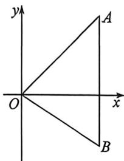

<!-- question-source:start -->
例1 (2026 届湖北智学联盟十月联考 T7) 已知 $a, b$ 在单位向量 $e$ 上投影向量都是 $4e$ , 且 $|a - b| = 6$ , 则当 $a$ 与 $b$ 夹角最大的时候, $a \cdot b$ 为 (A. 6 B. 5 C. 8 D. 7

<!-- question-source:end -->

![[高中/总复习/二轮/2026版高中《MST新思路思维拓展》二轮复习专题/上册/板块3_三角/考点一_向量的数量积计算/questions/answers/Q00092943A1.md]]
