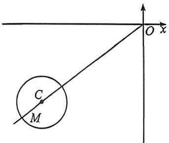

<!-- question-source:start -->
例5 (2026 江苏京通如皋一调 T7) 已知圆 $C: (x + 4)^{2} + (y + 3)^{2} = 1$ 及 $A(0, a), B(0, -a)$ 两点， $(a \in \mathbb{R}^{*})$ ，若圆 $C$ 上任一点 $M$ ，都满足 $\angle AMB > \frac{\pi}{2}$ ，则 $a$ 的取值范围是（A. $(0, 4)$ B. $[4, 6]$ C. $(4, +\infty)$ D. $(6, +\infty)$

<!-- question-source:end -->

![[高中/总复习/二轮/2026版高中《MST新思路思维拓展》二轮复习专题/上册/板块3_三角/考点一_向量的数量积计算/questions/answers/Q00092948A1.md]]
