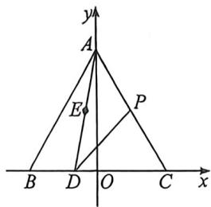
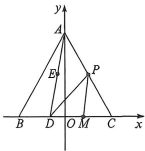

<!-- question-source:start -->
例8 (2026黑龙江哈六中九月月考T11·多选)已知△ABC是边长为3的等边三角形, $\overrightarrow{BC} = 3\overrightarrow{BD},\overrightarrow{AD} = 2$ $\overrightarrow{AE}$ , 则下列说法正确的是 ( )
A. $\overrightarrow{BE} = -\frac{2}{3}\overrightarrow{AB} +\frac{1}{6}\overrightarrow{AC}$ B. $\overrightarrow{CE}\cdot \overrightarrow{AD} = -\frac{5}{2}$ C. $\overrightarrow{AE}\cdot \overrightarrow{AB} = 4$ D. 若点 $P$ 是 $AC$ 边上的动点, 则 $\overrightarrow{PC}\cdot \overrightarrow{PD}$ 的最小值为 $-\frac{1}{4}$

<!-- question-source:end -->

![[高中/总复习/二轮/2026版高中《MST新思路思维拓展》二轮复习专题/上册/板块3_三角/考点一_向量的数量积计算/questions/answers/Q00092950A1.md]]
