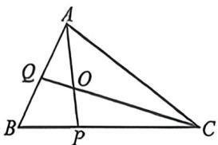
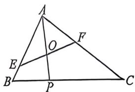

<!-- question-source:start -->
例9 (2026 届吉林松原十月联考 T18) 如图所示, 在 $\triangle ABC$ 中, $P$ 在线段 $BC$ 上, 满足 $2\overrightarrow{BP} = \overrightarrow{PC}$ , $O$ 是线段 $AP$ 的中点.

图1

图2

(1)延长 $CO$ 交 $AB$ 于点 $Q$ (如图1), 若 $4\overrightarrow{AB} \cdot \overrightarrow{AC} = 15\overrightarrow{AO} \cdot \overrightarrow{QC}$ , 求 $\frac{AC}{AB}$ 的值;

(2) 过点 $O$ 的直线与边 $AB, AC$ 分别交于点 $E, F$ (如图 2), 设 $\overrightarrow{EB} = \lambda \overrightarrow{AE}, \overrightarrow{FC} = \mu \overrightarrow{AF}$ .

(1) 求证: $2\lambda + \mu$ 为定值;

(Ⅱ)设 $\triangle AEF$ 的面积为 $S_{1}$ ， $\triangle ABC$ 的面积为 $S_{2}$ ，求 $\frac{S_{1}}{S_{2}}$ 的最小值.

(Ⅰ)法一；依题意，因为 $2 \overrightarrow{BP} = \overrightarrow{PC}$ ，所以 $\overrightarrow{AP} = \overrightarrow{AB} + \overrightarrow{BP} = \overrightarrow{AB} + \frac{1}{3} \overrightarrow{BC} = \overrightarrow{AB} + \frac{1}{3} (\overrightarrow{BA} + \overrightarrow{AC}) = \frac{2}{3} \overrightarrow{AB} + \frac{1}{3} \overrightarrow{AC}$ ，
<!-- question-source:end -->

![[高中/总复习/二轮/2026版高中《MST新思路思维拓展》二轮复习专题/上册/板块3_三角/考点一_向量的数量积计算/questions/answers/Q00093280A1.md]]
