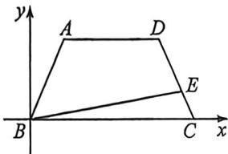

<!-- question-source:start -->
例3 (2026届重庆八中十月月考T13)已知在梯形ABCD中, $\overrightarrow{AD} = \frac{1}{2}\overrightarrow{BC}$ , 且 $\angle ABC = 60^{\circ}$ , $|AD| = |AB| = 1$ , 点E满足 $\overrightarrow{DE} = 2\overrightarrow{EC}$ , 则 $\overrightarrow{AE} \cdot \overrightarrow{BE} =$ \_\_\_\_.

<!-- question-source:end -->

![[高中/总复习/二轮/2026版高中《MST新思路思维拓展》二轮复习专题/上册/板块3_三角/考点一_向量的数量积计算/questions/answers/Q00093295A1.md]]
