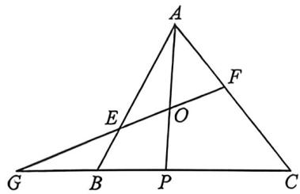

> [!faq]- 例题解析
>
> > [!success]- **【答案】** 详见解析
>
> > [!note]- **【解析】**
> > 因为 O 是线段 AP 的中点，所以 $\overrightarrow{AO} = \frac{1}{2}\overrightarrow{AP} = \frac{1}{3}\overrightarrow{AB} + \frac{1}{6}\overrightarrow{AC}$ ，设 $\overrightarrow{AB} = x\overrightarrow{AQ}$ ，则有 $\overrightarrow{AO} = \frac{x}{3}\overrightarrow{AQ} + \frac{1}{6}\overrightarrow{AC}$ ，
> >
> > 因为 C, O, Q 三点共线，所以 $\frac{x}{3} + \frac{1}{6} = 1$ ，解得 $x = \frac{5}{2}$ ，即 $AQ = \frac{2}{5} AB$ ，所以 $QB = \frac{3}{5} AB$ ，所以 $\frac{AQ}{QB} = \frac{2}{3}$ ;
> >
> > $$
> > 4 \overrightarrow {A B} \cdot \overrightarrow {A C} = 1 5 \overrightarrow {A O} \cdot \overrightarrow {Q C} \Rightarrow 4 \overrightarrow {A B} \cdot \overrightarrow {A C} = 1 5 \times \frac {1}{2} \overrightarrow {A P} \cdot (\overrightarrow {Q A} + \overrightarrow {A C}) \Rightarrow 4 \overrightarrow {A B} \cdot \overrightarrow {A C} = 1 5 \times \frac {1}{2} (\overrightarrow {A B} + \overrightarrow {B Q}) \cdot \left(\frac {2}{5} \overrightarrow {B A} + \overrightarrow {A C}\right)
> > $$
> >
> > $$
> > \Rightarrow 4 \overrightarrow {A B} \cdot \overrightarrow {A C} = 1 5 \times \frac {1}{2} (\overrightarrow {A B} + \frac {1}{3} \overrightarrow {B C}) \cdot (- \frac {2}{5} \overrightarrow {A B} + \overrightarrow {A C}) \Rightarrow 4 \overrightarrow {A B} \cdot \overrightarrow {A C} = 1 5 \times \frac {1}{2} [ \overrightarrow {A B} + \frac {1}{3} (\overrightarrow {B A} + \overrightarrow {A C}) ]
> > $$
> >
> > $$
> > \cdot \left(- \frac {2}{5} \overrightarrow {A B} + \overrightarrow {A C}\right)
> > $$
> >
> > $$
> > \Rightarrow 4 \overrightarrow {A B} \cdot \overrightarrow {A C} = 1 5 \times \frac {1}{2} \left(\frac {2}{3} \overrightarrow {A B} + \frac {1}{3} \overrightarrow {A C}\right) \cdot \left(- \frac {2}{5} \overrightarrow {A B} + \overrightarrow {A C}\right) \Rightarrow 4 \overrightarrow {A B} \cdot \overrightarrow {A C} = - 2 \overrightarrow {A B ^ {2}} + 5 \overrightarrow {A B} \cdot \overrightarrow {A C} - \overrightarrow {A B} \cdot \overrightarrow {A C} + \frac {5}{2} \overrightarrow {A C ^ {2}}
> > $$
> >
> > $$
> > \Rightarrow 2 \overrightarrow {A B ^ {2}} = \frac {5}{2} \overrightarrow {A C ^ {2}} \Rightarrow \frac {A C}{A B} = \frac {2 \sqrt {5}}{5},
> > $$
> >
> > 法二：令 $\overrightarrow{CO} = \lambda \overrightarrow{CQ},\overrightarrow{AQ} = \mu \overrightarrow{AB},\overrightarrow{AO} = \lambda \overrightarrow{AQ} +(1 - \lambda)\overrightarrow{AC} = \lambda \mu \overrightarrow{AB} +(1 - \lambda)\overrightarrow{AC},\overrightarrow{AP} = \frac{1}{3}\overrightarrow{AC} +\frac{2}{3}\overrightarrow{AB} = 2\overrightarrow{AO}$ ，所以 $\left\{ \begin{array}{l}\lambda = \frac{5}{6}\\ \mu = \frac{2}{5} \end{array} \right.,4\overrightarrow{AB}\cdot \overrightarrow{AC} = 15\overrightarrow{AO}\cdot \overrightarrow{QC} = 15\left(\frac{1}{3}\overrightarrow{AB} +\frac{1}{6}\overrightarrow{AC}\right)\left(\overrightarrow{AC} -\frac{2}{5}\overrightarrow{AB}\right)\Rightarrow 2\overrightarrow{AB^2} = \frac{5}{2}\overrightarrow{AC^2}\Rightarrow \frac{AC}{AB} = \frac{2\sqrt{5}}{5};$
> >
> > (2)(|)根据题意 $\overrightarrow{AB} = \overrightarrow{AE} +\overrightarrow{EB} = \overrightarrow{AE} +\lambda \overrightarrow{AE} = (1 + \lambda)\overrightarrow{AE}$ ，同理可得： $\overrightarrow{AC} = (1 + \mu)\overrightarrow{AF},$
> >
> > 由(1)可知， $\overrightarrow{AO}=\frac{1}{2}\overrightarrow{AP}=\frac{1}{3}\overrightarrow{AB}+\frac{1}{6}\overrightarrow{AC}$ ，所以 $\overrightarrow{AO}=\frac{1+\lambda}{3}\overrightarrow{AE}+\frac{1+\mu}{6}\overrightarrow{AF}$ ，因为E,O,F三点共线，所以 $\frac{1+\lambda}{3}+\frac{1+\mu}{6}=1$
> >
> > 化简得 $2\lambda + \mu = 3$ ，即 $2\lambda + \mu$ 为定值，且定值为 3；
> >
> > (Ⅱ)根据题意, $S_{1}=\frac{1}{2}\left|AE\right|\left|AF\right|\sin\angle BAC$ , $S_{2}=\frac{1}{2}\left|AB\right|\left|AC\right|\sin\angle BAC=\frac{1}{2}(1+\lambda)\left|AE\right|(1+\mu)$ $\left|AF\right|\sin\angle BAC,$
> >
> > 所以 $\frac{S_1}{S_2} = \frac{\frac{1}{2}|AE||AF|\sin\angle BAC}{\frac{1}{2}(1 + \lambda)|AE|(1 + \mu)|AF|\sin\angle BAC} = \frac{1}{(1 + \lambda)(1 + \mu)}$ ，由（|）可知 $2\lambda +\mu = 3$ ，则 $\mu = 3 - 2\lambda$
> >
> > 所以 $\frac{S_1}{S_2} = \frac{1}{(1 + \lambda)(1 + 3 - 2\lambda)} = \frac{1}{-2\lambda^2 + 2\lambda + 4} = \frac{1}{-2\left(\lambda - \frac{1}{2}\right)^2 + \frac{9}{2}}$ ，易知，当 $\lambda = \frac{1}{2}$ 时， $\frac{S_1}{S_2}$ 有最小值，此时 $\frac{S_1}{S_2} = \frac{2}{9}$ .
> >
> > 背景解读：
> >
> > 由于梅氏定理不适合作为解答题,故本题仅仅利用梅氏定理来解读背景,
> >
> > 
> >
> > (1)由于 C、O、Q 三点共线, 所以 $\frac{AQ}{QB} \cdot \frac{BC}{CP} \cdot \frac{PO}{OA} = 1$ , 所以 $\frac{AQ}{QB} \cdot \frac{3}{2} \cdot \frac{1}{1} = 1 \Rightarrow \frac{AQ}{QB} = \frac{2}{3}$ ;
> >
> > 由于 $A, O, P$ 三点共线，所以 $\frac{BP}{PC} \cdot \frac{CO}{OQ} \cdot \frac{QA}{AB} = 1$ ，所以 $\frac{1}{2} \cdot \frac{CO}{OQ} \cdot \frac{2}{5} = 1 \Rightarrow \frac{CO}{OQ} = 5$ ;
> >
> > $$
> > 4 \overrightarrow {A B} \cdot \overrightarrow {A C} = 1 5 \overrightarrow {A O} \cdot \overrightarrow {Q C} = 1 5 \left(\frac {1}{3} \overrightarrow {A B} + \frac {1}{6} \overrightarrow {A C}\right) (\overrightarrow {A C} - \frac {2}{5} \overrightarrow {A B}) \Rightarrow 2 \overrightarrow {A B ^ {2}} = \frac {5}{2} \overrightarrow {A C ^ {2}} \Rightarrow \frac {A C}{A B} = \frac {2 \sqrt {5}}{5};
> > $$
> >
> > (2)延长 $EF$ 交 $BC$ 延长线于 $G$ , $\left\{ \begin{array}{l} G, E, O \text{三点共线} \Leftrightarrow \frac{BG}{GP} \cdot \frac{PO}{OA} \cdot \frac{AE}{EB} = 1 \\ G, F, O \text{三点共线} \Leftrightarrow \frac{CG}{GP} \cdot \frac{PO}{OA} \cdot \frac{AF}{FC} = 1 \end{array} \right.$ , 不妨设 $BG = x, BP = y, PC =$
> >
> > 2y,所以 $\left\{\begin{aligned}\lambda&=\frac{x}{x+y}\\ \mu&=\frac{x+3y}{x+y}\end{aligned}\right.$ ,2 $\lambda+\mu=3$ .
