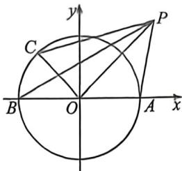

> [!faq]- 例题解析
>
> > [!success]- **【答案】** 0
>
> > [!note]- **【解析】**
> > $$
> > \overrightarrow {O P ^ {2}} + 2 \overrightarrow {P O} \cdot \overrightarrow {O C} - 1 = 3 r ^ {2} - 2 r [ \cos \beta \cos \alpha + \sin \beta \sin \alpha ] - 1 = 3 r ^ {2} - 2 r \cos (\alpha - \beta) - 1.
> > $$
> >
> > 所以 $3\overrightarrow{OP}^2 + 2\overrightarrow{PO} \cdot \overrightarrow{OC} - 1 \geqslant 3r^2 - 2r - 1$ ，当 $\cos (\alpha - \beta) = 1$ 时等号成立，又 $y = 3r^2 - 2r - 1$ 在 $[1, +\infty)$ 上单调递增，
> >
> > 
> >
> > 所以当 $r = 1$ 时， $y = 3r^2 - 2r - 1$ 取到最小值0，所以 $\overrightarrow{PA} \cdot \overrightarrow{PB} + \overrightarrow{PB} \cdot \overrightarrow{PC} + \overrightarrow{PC} \in \overrightarrow{PA}$ 的最小值为0.
> >
> > 法二:利用极化恒等式, $\overrightarrow{PA}\cdot\overrightarrow{PB}+\overrightarrow{PB}\cdot\overrightarrow{PC}+\overrightarrow{PC}\cdot\overrightarrow{PA}=|PO|^{2}-1+\overrightarrow{PC}\cdot(\overrightarrow{PA}+\overrightarrow{PB})=|PO|^{2}+2\overrightarrow{PC}\cdot\overrightarrow{PO}-1=|PO|^{2}+2(\overrightarrow{PO}+\overrightarrow{OC})\overrightarrow{PO}-1=3|OP|^{2}-2\overrightarrow{OP}\cdot\overrightarrow{OC}-1\geqslant3|OP|^{2}-2|OP|-1\geqslant0$ ,当且仅当 $|OP|=1$ 时取等,故答案为:0.
