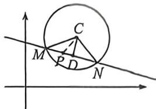
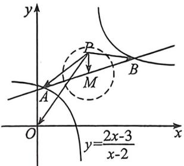

> [!faq]- 例题解析
>
> > [!success]- **【答案】** ACD
>
> > [!note]- **【解析】**
> > 对于选项 A, 因为直线 $l: mx - y - 2m + 3 = 0$ , 所以 $l: m(x - 2) + (-y + 3) = 0$ , 所以 $\left\{ \begin{array}{l} x - 2 = 0 \\ -y + 3 = 0 \end{array} \right.$ , 所以 $\left\{ \begin{array}{l} x = 2 \\ y = 3 \end{array} \right.$ , 所以直线 $l$ 过定点 $P(2,3)$ , 所以选项 A 正确; 对于选项 B, 因为 $C: (x - 4)^2 + (y - 5)^2 = 12$ 的圆心为 $C(4,5)$ , 半径为 $r = 2\sqrt{3}$ , 因为直线 $l$ 过定点 $(2,3)$ , 所以过定点 $(2,3)$ 的直径是最长的弦, 所以过定点 $(2,3)$ 且与这条直径所在直线垂直的直线与圆相交的弦长 $|MN|$ 是最短的弦, 因为定点 $(2,3)$ 到圆心 $C(4,5)$ 的距离为 $d = |CP| = \sqrt{(4 - 2)^2 + (5 - 3)^2} = 2\sqrt{2}$ , 所以 $|MN|$ 的最小值为 $2\sqrt{r^2 - d^2}$ .
> > =4,所以选项B错误;
> >
> > 对于选项C，利用极化恒等式， $\overrightarrow{CM}\cdot \overrightarrow{CN} = |CD|^2 -|MD|^2 = 2|CD|^2 -|CM|^2 = 2|CD|^2$ -12，由于 $|CP|\geqslant |CD|\geqslant 0$ ，所以 $-12\leqslant \overrightarrow{CM}\cdot \overrightarrow{CN}\leqslant 4$ ，所以选项C正确；
> >
> > 
> >
> > 选项 D, 因为圆 C 上恰有三个点到直线 l 的距离等于 $\sqrt{3}$ , 所以圆心 C 到直线 l 的距离等
> >
> > 于 $\sqrt{3}$ , 因为 $l: mx - y - 2m + 3 = 0$ , 圆心 $C(4,5)$ 所以圆心 $C$ 到直线 $l$ 的距离 $d = \frac{|4m - 5 - 2m + 3|}{\sqrt{m^2 + 1}} = \sqrt{3}$ , 所以 $m = 4 \pm \sqrt{15}$ , 所以选项 D 正确. 故选: ACD.
> >
> > (2026 届河北秦皇岛一中十月月考 T13)已知直线 $y = kx + 2 - {2k}$ 与曲线 $y = \frac{{2x} - 3}{x - 2}$ 交于 $A,B$ 两点, 平面上的动点 $P$ 满足, $\left| {\overrightarrow{PA} + \overrightarrow{PB}}\right|  \leq  2$ ,则 $\left| {\overrightarrow{PO}}\right|$ 的最大值为\_\_\_\_.
> >
> > 解析 由 $y = k(x - 2) + 2$ 可知, 直线过定点 $M(2,2)$ , 由 $y = \frac{2x - 3}{x - 2} = 2 + \frac{1}{x - 2}$ 知定点 $M(2,2)$ 为曲线的对称中心, 即 $M$ 为 $AB$ 的中点, 如图,
> >
> > 
> >
> > 所以 $|\overrightarrow{PA} + \overrightarrow{PB}| = 2|\overrightarrow{PM}| \leqslant 2$ ，所以点 $P$ 的轨迹为以 $M$ 为圆心，1 为半径的圆（及内部），所以 $|\overrightarrow{PO}| \leqslant |\overrightarrow{OM}| + 1 = 2\sqrt{2} + 1.$ 故答案为： $2\sqrt{2} + 1.$
